# Deye Hybrid Inverter — User Manual

**Models:** SUN-14K-SG05LP3-EU-SM2 · SUN-15K-SG05LP3-EU-SM2 · SUN-16K-SG05LP3-EU-SM2 · SUN-18K-SG05LP3-EU-SM2 · SUN-20K-SG05LP3-EU-SM2

| | |
|---|---|
| Výrobce | Ningbo Deye Inverter Technology Co., Ltd. |
| Verze dokumentu | V2.2.0, revize 2026-03-19 |
| Rozsah | 58 stran (tištěné číslování −2 oproti stranám PDF) |
| Zdroj | `manual_sun-14-20k-sg05lp3-eu-sm2_20260319_en.pdf` |

> **O tomto převodu.** Text manuálu je ponechán v originální angličtině — jde o technický dokument, kde by překlad zanášel riziko chyby. Obrázky jsou vyextrahované z vektorové grafiky PDF ve 200 DPI do `images/`. **Popisy obrázků jsou psané česky** a jsou označené jako `📌 Popis:` — to je jediná přidaná část, v originálním manuálu není. Tabulky jsou přepsané do Markdownu.

---

## Obsah

| # | Kapitola | Tištěné strany |
|---|---|---|
| 1 | [Safety Introductions](#1-safety-introductions) | 01–02 |
| 2 | [Product Instructions](#2-product-instructions) | 02–05 |
| 3 | [Installation](#3-installation) | 06–29 |
| 4 | [Operation](#4-operation) | 30 |
| 5 | [LCD Display Icons](#5-lcd-display-icons) | 31–44 |
| 6 | [Mode](#6-mode) | 44–45 |
| 7 | [Limitation of Liability](#7-limitation-of-liability) | 45–48 |
| 8 | [Datasheet](#8-datasheet) | 49–50 |
| 9 | [Appendix I — RJ45 pinouts](#9-appendix-i) | 51–53 |
| 10 | [Appendix II — CT dimensions](#10-appendix-ii) | 54 |
| 11 | [EU Declaration of Conformity](#11-eu-declaration-of-conformity) | 54–55 |

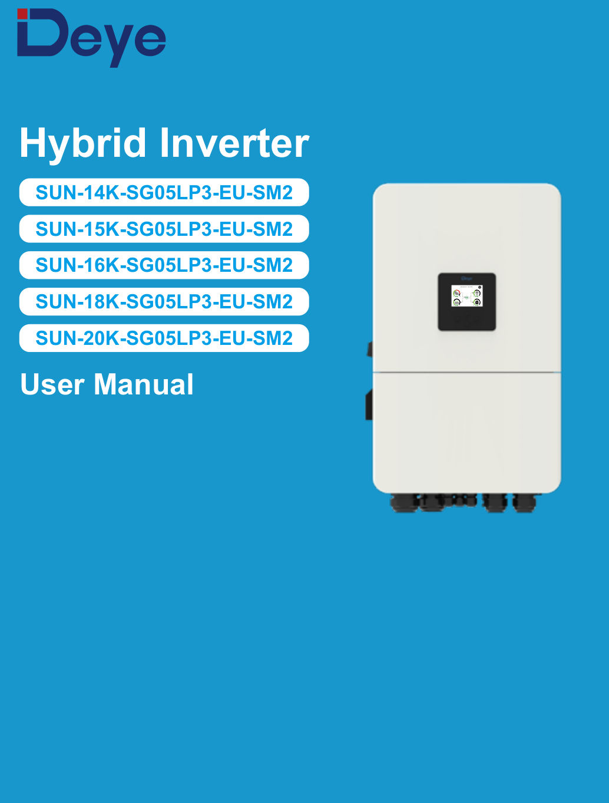

📌 **Popis:** Titulní strana. Modré pozadí, logo Deye vlevo nahoře, pod ním nadpis „Hybrid Inverter" a pět bílých oválných štítků s označením modelů (SUN-14K až SUN-20K-SG05LP3-EU-SM2). Vpravo perspektivní render měniče: světle šedá skříň na výšku, nahoře čtvercový LCD displej, dole řada kabelových průchodek. Dvoudílná konstrukce — horní část je výkonová, spodní připojovací komora.

---

## About This Manual

The manual mainly describes the product information, guidelines for installation, operation and maintenance. The manual cannot include complete information about the photovoltaic (PV) system.

### How to Use This Manual

Read the manual and other related documents before performing any operation on the inverter. Documents must be stored carefully and be available at all times.

**Contents may be periodically updated or revised due to product development. The information in this manual is subject to change without notice.** The latest manual can be acquired via service@deye.com.cn

---

## 1. Safety Introductions

### Labels description

| Label | Description |
|---|---|
| ⚡ v trojúhelníku | Caution, risk of electric shock symbol indicates important safety instructions, which if not correctly followed, could result in electric shock. |
| ! v trojúhelníku | The DC input terminals of the inverter must not be grounded. |
| 🌡 v trojúhelníku | Surface high temperature, Please do not touch the inverter case. |
| ⚡ + hodiny 5 min | The AC and DC circuits must be disconnected separately, and the maintenance personnel must wait for 5 minutes before they are completely powered off before they can start working. |
| CE | CE mark of conformity |
| 📖 | Please read the instructions carefully before use. |
| Přeškrtnutá popelnice | Symbol for the marking of electrical and electronics devices according to Directive 2002/96/EC. Indicates that the device, accessories and the packaging must not be disposed as unsorted municipal waste and must be collected separately at the end of the usage. Please follow Local Ordinances or Regulations for disposal or contact an authorized representative of the manufacturer for information concerning the decommissioning of equipment. |

### Safety instructions

- This chapter contains important safety and operating instructions. Read and keep this manual for future reference.
- Before using the inverter, please read the instructions and warning signs of the battery and corresponding sections in the instruction manual.
- Do not disassemble the inverter. If you need maintenance or repair, take it to a professional service center.
- Improper reassembly may result in electric shock or fire.
- To reduce risk of electric shock, disconnect all wires before attempting any maintenance or cleaning. Turning off the unit will not reduce this risk.
- Caution: Only qualified personnel can install this device with battery.
- Never charge a frozen battery.
- For optimum operation of this inverter, please follow required specification to select appropriate cable size. It is very important to correctly operate this inverter.
- Be very cautious when working with metal tools on or around batteries. Dropping a tool may cause a spark or short circuit in batteries or other electrical parts, even cause an explosion.
- Please strictly follow installation procedure when you want to disconnect AC or DC terminals. Please refer to "Installation" section of this manual for the details.
- Grounding instructions — this inverter should be connected to a permanent grounded wiring system. Be sure to comply with local requirements and regulation to install this inverter.
- Never cause AC output and DC input short circuited. Do not connect to the mains when DC input short circuits.

---

## 2. Product Instructions

This is a multifunctional inverter, combining functions of inverter, solar charger and battery charger to offer uninterruptible power support with portable size. Its comprehensive LCD display offers user configurable and easy accessible button operation such as battery charging, AC/solar charging, and acceptable input voltage based on different applications.

### 2.1 Product Overview

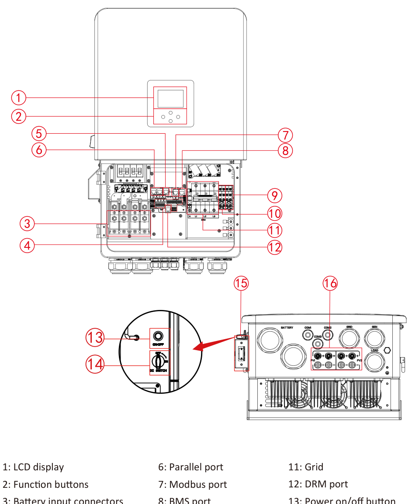

📌 **Popis:** Technický nákres měniče se zakótovanými pozicemi 1–16. Nahoře čelní pohled se sejmutým krytem připojovací komory — vidět je vnitřní uspořádání svorkovnic a jističů. Vlevo dole detail levého boku (vypínač a DC odpojovač), vpravo dole pohled zespodu na řadu kabelových průchodek a konektorů.

| # | Popis | | # | Popis | | # | Popis |
|---|---|---|---|---|---|---|---|
| 1 | LCD display | | 7 | Modbus port | | 13 | Power on/off button |
| 2 | Function buttons | | 8 | BMS port | | 14 | DC switch |
| 3 | Battery input connectors | | 9 | Generator input | | 15 | WiFi Interface |
| 4 | Function port | | 10 | Load | | 16 | PV input |
| 5 | Meter-485 port | | 11 | Grid | | | |
| 6 | Parallel port | | 12 | DRM port | | | |

### 2.2 Product Size

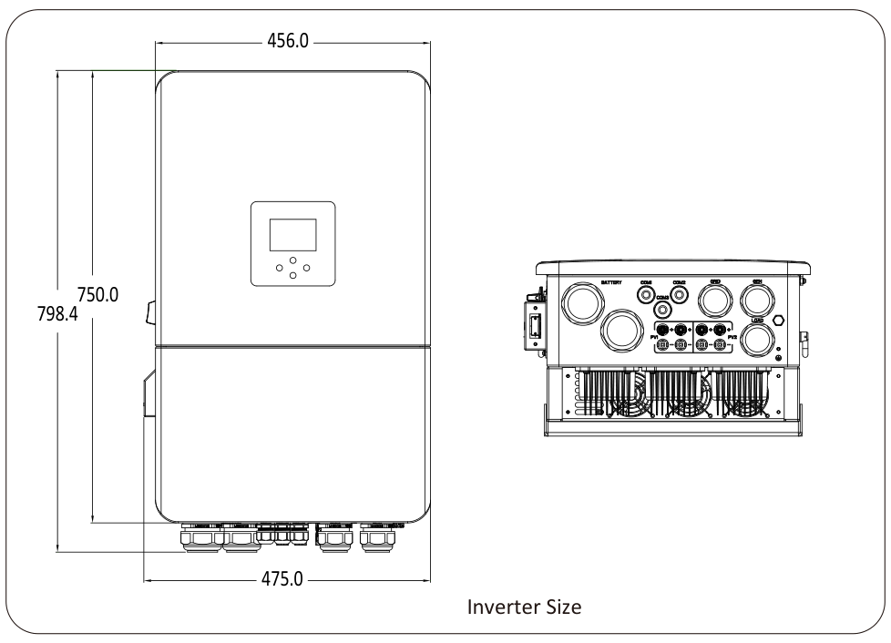

📌 **Popis:** Kótovaný čelní a horní pohled. Čelní pohled: šířka **456,0 mm**, výška skříně **750,0 mm**, celková výška včetně průchodek **798,4 mm**, šířka přes spodní průchodky **475,0 mm**. Vpravo pohled shora s kruhovými otvory pro PV a AC vývody.

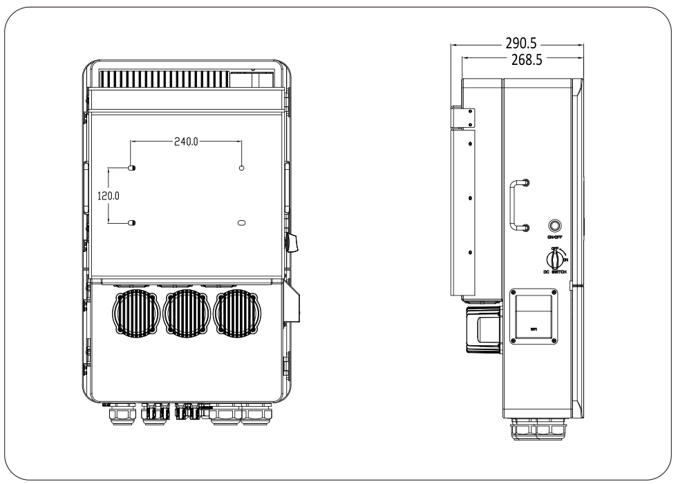

📌 **Popis:** Vlevo zadní pohled s roztečí montážních otvorů závěsné desky — **240,0 mm** vodorovně a **120,0 mm** svisle; dole tři kruhové ventilátory chlazení. Vpravo boční pohled: hloubka **290,5 mm** celkem, **268,5 mm** bez konzoly. Toto jsou rozměry pro návrh místa v technické místnosti.

### 2.3 Product Features

- 230V/400V Three phase Pure sine wave inverter.
- Self-consumption and feed-in to the grid.
- Auto restart while AC is recovering.
- Programmable supply priority for battery or grid.
- Programmable multiple operation modes: On grid, off grid and UPS.
- Configurable battery charging current/voltage based on applications by LCD setting.
- Configurable AC/Solar/Generator Charger priority by LCD setting.
- Compatible with mains voltage or generator power.
- Overload/over temperature/short circuit protection.
- Smart battery charger design for optimized battery performance.
- With limit function, prevent excess power overflow to the grid.
- Supporting WIFI monitoring and build-in 2 strings of MPP trackers.
- Smart settable three stages MPPT charging for optimized battery performance.
- Time of use function.
- Smart Load Function.

### 2.4 Basic System Architecture

The following illustration shows basic application of this inverter. It also includes following devices to have a Complete running system:

- Generator or Utility
- PV modules

Consult with your system integrator for other possible system architectures depending on your requirements. This inverter can power all kinds of appliances in home or office environment, including motor type appliances such as refrigerator and air conditioner.

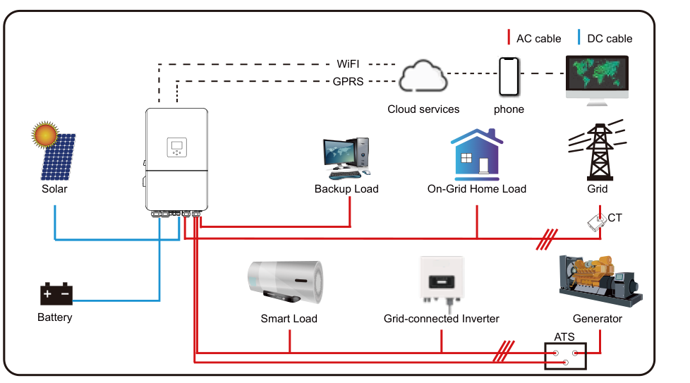

📌 **Popis:** Blokové schéma celého systému. Uprostřed vlevo měnič, do něj vstupuje **Solar** (PV panely, modrá DC čára) a **Battery** (baterie, modrá DC čára). Z měniče vede červená AC čára do **Backup Load** (zálohované spotřebiče) a přes společnou sběrnici k **On-Grid Home Load**, **Smart Load**, **Grid-connected Inverter** a **Generator** s **ATS** přepínačem. Vpravo nahoře **Grid** (distribuční síť) se symbolem **CT** (proudový transformátor) na přívodu. Nahoře přerušovaně komunikace: **WiFi** a **GPRS** do **Cloud services**, odtud na **phone** a monitorovací portál. Legenda rozlišuje AC kabel (červeně) a DC kabel (modře).

---

## 3. Installation

### 3.1 Parts List

Check the equipment before installation. Please make sure nothing is damaged in the package. You should have received the items in the following package:

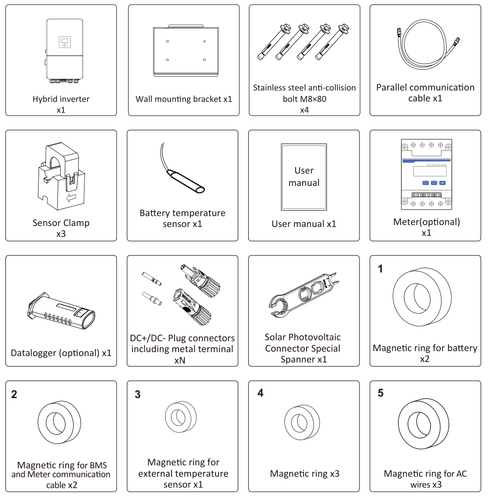

📌 **Popis:** Mřížka 12 orámovaných políček s perokresbou každé položky a popiskem pod ní: **Hybrid inverter ×1**, **Wall mounting bracket ×1**, **Stainless steel anti-collision bolt M8×80 ×4**, **Parallel communication cable ×1**, **Sensor Clamp ×3** (rozevírací proudové kleště CT), **Battery temperature sensor ×1**, **User manual ×1**, **Meter (optional) ×1** (elektroměr na DIN lištu), **Datalogger (optional) ×1**, **DC+/DC− Plug connectors including metal terminal ×N**, **Solar Photovoltaic Connector Special Spanner ×1**, a pět typů **feritových kroužků** (magnetic ring) číslovaných 1–5: pro baterii ×2, pro BMS a Meter kabel ×2, pro externí teplotní čidlo ×1, obecné ×3 a pro AC vodiče ×3.

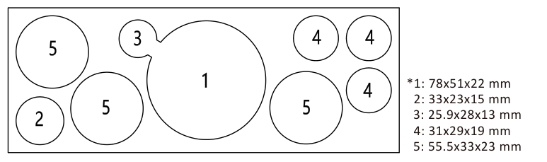

📌 **Popis:** Schéma rozložení feritových kroužků v krabici s legendou rozměrů — 1: 78×51×22 mm, 2: 33×23×15 mm, 3: 25,9×28×13 mm, 4: 31×29×19 mm, 5: 55,5×33×23 mm. Kroužky jsou v manuálu opakovaně odkazované čísly, takže tato tabulka určuje, který kroužek patří na který kabel.

### 3.2 Product handling requirements

Lift the inverter out of the packing box and transport it to designated installation location.

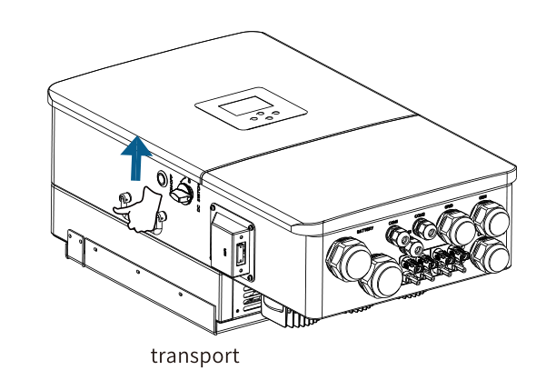

📌 **Popis:** Perokresba měniče v poloze naležato s modrou šipkou směřující vzhůru u bočního madla — ukazuje správný úchop při zvedání. Popisek „transport".

> ⚠️ **CAUTION: Improper handling may cause personal injury!**
> - Arrange an appropriate number of personnel to carry the inverter according to its weight, and installation personnel should wear protective equipment such as anti-impact shoes and gloves.
> - Placing the inverter directly on a hard ground may cause damage to its metal enclosure. Protective materials such as sponge pad or foam cushion should be placed underneath the inverter.
> - Move the inverter by one or two people or by using a proper transport tool.
> - Move the inverter by holding the handles on it. Do not move the inverter by holding the terminals.

### 3.3 Mounting instructions

#### Installation Precaution

This Hybrid inverter is designed for outdoor use (IP65). Please make sure the installation site meets below conditions:

- Not in direct sunlight
- Not in areas where highly flammable materials are stored
- Not in potential explosive areas
- Not in the cool air directly
- Not near the television Antenna or antenna cable
- Not higher than altitude of about 3000 meters above sea level
- Not in environment of precipitation or humidity (>95%)

Please AVOID direct sunlight, rain exposure, snow laying up during installation and operation. Before connecting all wires, please take off the metal cover by removing screws as shown below:

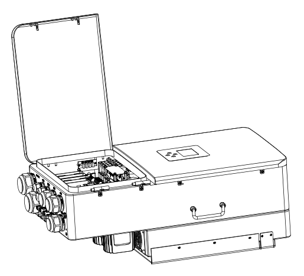

📌 **Popis:** Perokresba měniče v šikmém pohledu s odklopeným horním krytem připojovací komory — odkrývá vnitřní svorkovnice. Ukazuje, že kryt se po vyšroubování šroubů vyklápí vzhůru, nikoli snímá dopředu.

#### Installations Tools

Installation tools can refer to the following recommended ones. Also, use other auxiliary tools on site.

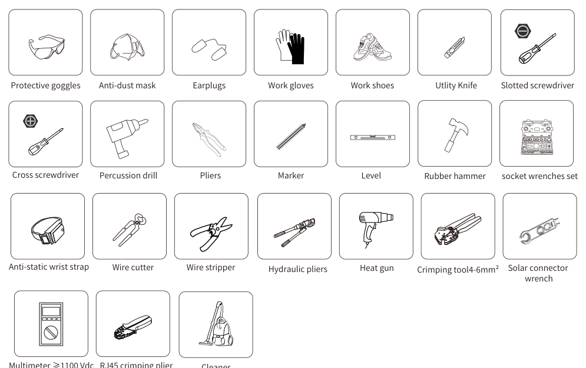

📌 **Popis:** Mřížka 21 políček s perokresbou nářadí: Protective goggles, Anti-dust mask, Earplugs, Work gloves, Work shoes, Utility Knife, Slotted screwdriver, Cross screwdriver, Percussion drill, Pliers, Marker, Level, Rubber hammer, socket wrenches set, Anti-static wrist strap, Wire cutter, Wire stripper, Hydraulic pliers, Heat gun, Crimping tool 4–6 mm², Solar connector wrench, **Multimeter ≥1100 Vdc**, RJ45 crimping plier, Cleaner.

#### Considering the following points before selecting where to install:

- Please select a vertical wall with load-bearing capacity for installation, suitable for installation on concrete or other non-flammable surfaces, installation is shown below.
- Install this inverter at eye level in order to allow the LCD display to be read at all times.
- The ambient temperature is recommended to be between −40~60 °C to ensure optimal operation.
- Be sure to keep other objects and surfaces as shown in the diagram to guarantee sufficient heat dissipation and have enough space for removing wires.

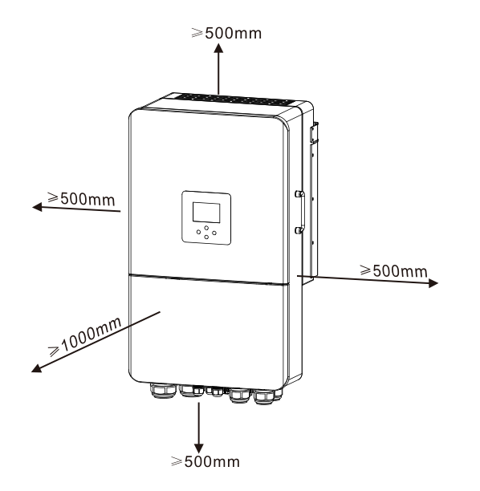

📌 **Popis:** Perspektivní nákres měniče na stěně se šipkami odstupů na všechny strany: **≥500 mm** vlevo, **≥500 mm** vpravo, **500 mm** nahoře, **500 mm** dole a **≥1000 mm** dopředu (před měničem). Pro instalaci v technické místnosti to znamená volný pruh zhruba 1,5 m široký a 1,8 m vysoký plus metr volného prostoru před přístrojem.

> For proper air circulation to dissipate heat, allow a clearance of approx. 50 cm to the side and approx. 50 cm above and below the unit. And 100 cm to the front.

#### Mounting the inverter

Remember that this inverter is heavy! Please be careful when lifting out from the package. Choose the recommend drill head (as shown in below pic) to drill 4 holes on the wall, **82–90 mm deep**.

1. Use a proper hammer to fit the expansion bolt into the holes.
2. Carry the inverter and holding it, make sure the hanger aim at the expansion bolt, fix the inverter on the wall.
3. Fasten the screw head of the expansion bolt to finish the mounting.

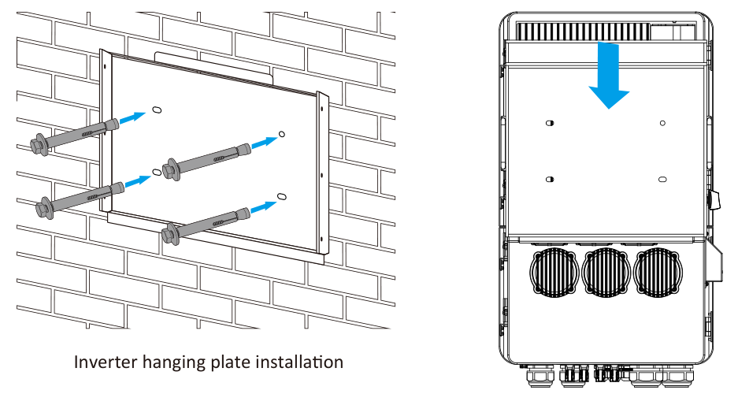

📌 **Popis:** Vlevo cihlová stěna s přiloženou obdélníkovou závěsnou deskou a čtyřmi modrými šipkami znázorňujícími zaražení expanzních kotev M8×80 do vyvrtaných otvorů; popisek „Inverter hanging plate installation". Vpravo zadní pohled na měnič s velkou modrou šipkou dolů — měnič se na desku nasazuje shora dolů (zavěšuje se).

### 3.4 Battery connection

For safe operation and compliance, a separate DC over-current protector or disconnect device is required between the battery and the inverter. In some applications, switching devices may not be required but over-current protectors are still required. Refer to the typical amperage in the table below for the required fuse or circuit breaker size.

**Chart 3-2 Cable size**

| Model | Wire Size | Cable (mm²) | Torque value (max) |
|---|---|---|---|
| 14/15/16 kW | 0 AWG | 50 | 24,5 Nm |
| 18/20 kW | 3/0 AWG | 70 | 24,5 Nm |

> ⚠️ All wiring must be performed by a professional person.
>
> ⚠️ Connecting the battery with a suitable cable is important for safe and efficient operation of the system. To reduce the risk of injury, refer to Chart 3-2 for recommended cables.

Please follow below steps to implement battery connection:

1. Please choose a suitable battery cable with correct connector which can well fit into the battery terminals.
2. Use a suitable screwdriver to unscrew the bolts and fit the battery connectors in, then fasten the bolt by the screwdriver, make sure the bolts are tightened with torque of **24.5 N.M** in clockwise direction.
3. Make sure polarity at both the battery and inverter is correctly connected.

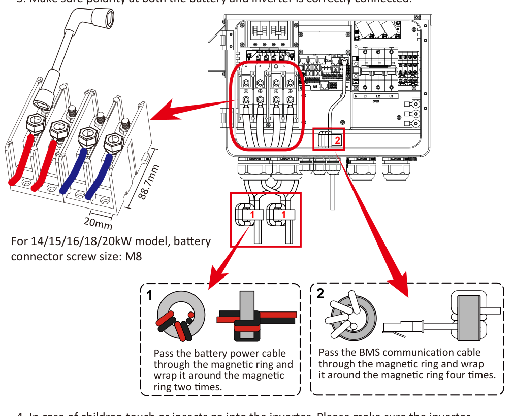

📌 **Popis:** Vlevo detail bateriové svorkovnice se čtyřmi šrouby M8 a nasazeným nástrčkovým klíčem; červené kabely na plus, modré na minus; kóty **20 mm** a **88,7 mm** udávají rozteče ok kabelových. Popisek: *For 14/15/16/18/20 kW model, battery connector screw size: **M8***. Vpravo nákres vnitřku připojovací komory s červeně zvýrazněnou bateriovou svorkovnicí a dvěma červenými šipkami do detailů (1) a (2): **(1)** „Pass the battery power cable through the magnetic ring and wrap it around the magnetic ring **two times**", **(2)** „Pass the BMS communication cable through the magnetic ring and wrap it around the magnetic ring **four times**".

4. In case of children touch or insects go into the inverter, Please make sure the inverter connector is fasten to waterproof position by twist it clockwise.

> ⚠️ Installation must be performed with care.
>
> ⚠️ Before making the final DC connection or closing DC breaker/disconnect, be sure positive (+) must be connect to positive (+) and negative (−) must be connected to negative (−). **Reverse polarity connection on battery will damage the inverter.**

#### 3.4.2 Function port definition

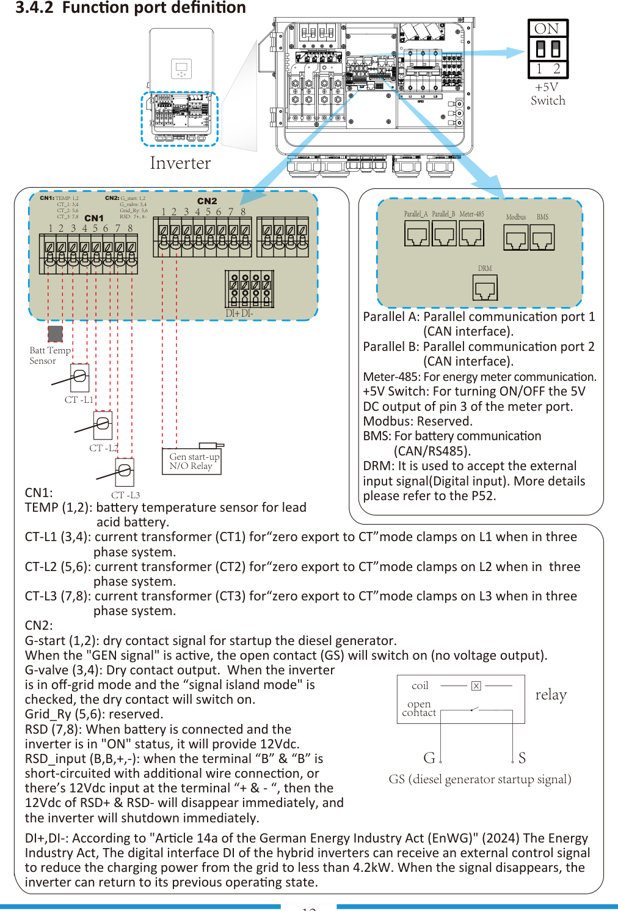

📌 **Popis:** Celostránkové schéma. Nahoře měnič s modře orámovanou spodní částí a dvěma modrými výnosovými šipkami do dvou detailů. **Vlevo** svorkovnice **CN1** a **CN2** — řady šroubových svorek s čárkovanými vývody k symbolům teplotního čidla a tří proudových transformátorů. **Vpravo** panel komunikačních konektorů RJ45 s legendou: Parallel A / Parallel B (paralelní komunikace, CAN), Meter-485, +5V Switch, Modbus (Reserved), BMS (CAN/RS485), DRM (externí digitální vstup).

**CN1:**

| Piny | Funkce |
|---|---|
| TEMP (1,2) | Battery temperature sensor for lead-acid battery. |
| CT-L1 (3,4) | Current transformer (CT1) for "zero export to CT" mode clamps on L1 when in three phase system. |
| CT-L2 (5,6) | Current transformer (CT2) for "zero export to CT" mode clamps on L2 when in three phase system. |
| CT-L3 (7,8) | Current transformer (CT3) for "zero export to CT" mode clamps on L3 when in three phase system. |

**CN2:**

| Piny | Funkce |
|---|---|
| G-start (1,2) | Dry contact signal for startup the diesel generator. When the "GEN signal" is active, the open contact (GS) will switch on (no voltage output). |
| G-valve (3,4) | Dry contact output. When the inverter is in off-grid mode and the "signal island mode" is checked, the dry contact will switch on. |
| Grid_Ry (5,6) | Reserved. |
| RSD (7,8) | When battery is connected and the inverter is in "ON" status, it will provide 12 Vdc. |
| RSD_input (B,B,+,−) | When the terminal "B" & "B" is short-circuited with additional wire connection, or there's 12 Vdc input at the terminal "+ & −", then the 12 Vdc of RSD+ & RSD− will disappear immediately, and the inverter will shutdown immediately. |
| DI+, DI− | According to "Article 14a of the German Energy Industry Act (EnWG)" (2024) The Energy Industry Act, the digital interface DI of the hybrid inverters can receive an external control signal to reduce the charging power from the grid to less than 4.2 kW. When the signal disappears, the inverter can return to its previous operating state. |

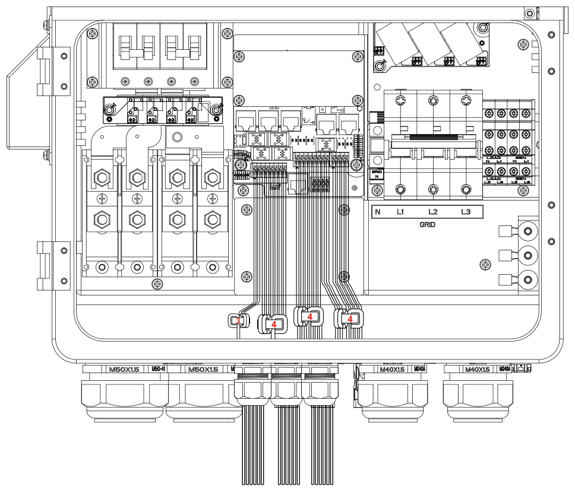

📌 **Popis:** Detailní perokresba vnitřku otevřeného měniče — vlevo bateriové svorky, uprostřed řady komunikačních svorkovnic CN1/CN2 s vějířem tenkých vodičů vedených dolů skrz průchodky, vpravo AC část s jističi a svorkovnicí označenou **N, L1, L2, L3, GRID**. Ukazuje reálné trasování slaboproudých vodičů uvnitř skříně.

| No. | Function Port | Installation Instructions |
|---|---|---|
| 3 | TEMP (1,2) | Wrap the wires three laps around the magnetic ring, then thread the end of wires through the magnetic ring. |
| 4 | CT_1 (3,4), CT_2 (5,6), CT_3 (7,8) | Wrap the wires three laps around the magnetic ring, then thread the end of wires through the magnetic ring. |
| 4 | G_start (1,2), G_valve (3,4), Grid_Ry (5,6) | Wrap the wires three laps around the magnetic ring, then thread the end of wires through the magnetic ring. |
| 4 | RSD (7,8), RSD_input (B,B,+,−) | Wrap the wires three laps around the magnetic ring, then thread the end of wires through the magnetic ring. |

#### 3.4.3 Temperature sensor connection for lead-acid battery

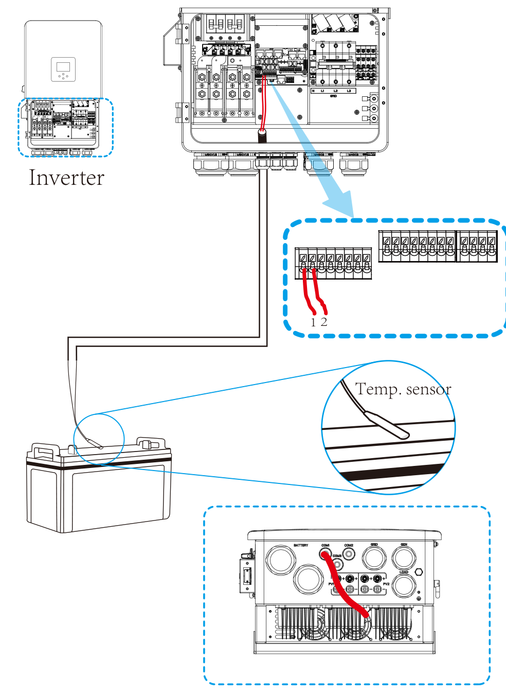

📌 **Popis:** Vícedílné schéma. Vlevo nahoře malý měnič s modře orámovanou spodní částí; vedle velký nákres vnitřku s červeně vyznačeným vodičem do svorky TEMP na CN1 a modrou výnosovou šipkou do detailu svorkovnice. Dole vlevo olověný akumulátor s čidlem přiloženým na horní straně a kruhovým detailem uchycení. Dole vpravo modře orámovaný pohled zespodu na měnič s červeným vodičem procházejícím průchodkou. **Platí jen pro olověné baterie** — u lithiových přebírá teplotní ochranu BMS.

### 3.5 Grid connection and backup load connection

- Before connecting to the grid, a separate AC breaker must be installed between the inverter and the grid, and also between the backup load and the inverter. This will ensure the inverter can be securely disconnected during maintenance and fully protected from over current.
- The recommended of AC breaker for the load port is **100 A** for 14/15/16/18/20 kW. The recommended of AC breaker for the grid port is **100 A** for 14/15/16/18/20 kW.
- There are three terminal blocks with "Grid", "Load" and "GEN" markings. Please do not misconnect input and output connectors.

> ⚠️ **Note:** In final installation, breaker certified according to **IEC 60947-1 and IEC 60947-2** shall be installed with the equipment. All wiring must be performed by a qualified personnel. It is very important for system safety and efficient operation to use appropriate cable for AC input connection. To reduce risk of injury, please use the proper recommended cable as below.

**Chart 3-3 Recommended Size for AC wires**

Grid connection and backup load connection (Copper wires):

| Model | Wire Size | Cable (mm²) | Torque value (max) |
|---|---|---|---|
| 14/15/16/18/20 kW | 6 AWG | 10 | 1,2 Nm |

Grid connection and backup load connection (Copper wires) (bypass):

| Model | Wire Size | Cable (mm²) | Torque value (max) |
|---|---|---|---|
| 14/15/16/18/20 kW | 4 AWG | 16 | 1,2 Nm |

#### Please follow below steps to implement Grid, load and Gen port connection:

1. Before making Grid, load and Gen port connection, be sure to turn off AC breaker or disconnector first.
2. Remove insulation sleeve 10 mm length, unscrew the bolts. Thread the wires through the magnetic ring firstly, then insert these wires into the terminals according to polarities indicated on the terminal block. Tighten the terminal screws and make sure the wires are completely and safely connected.

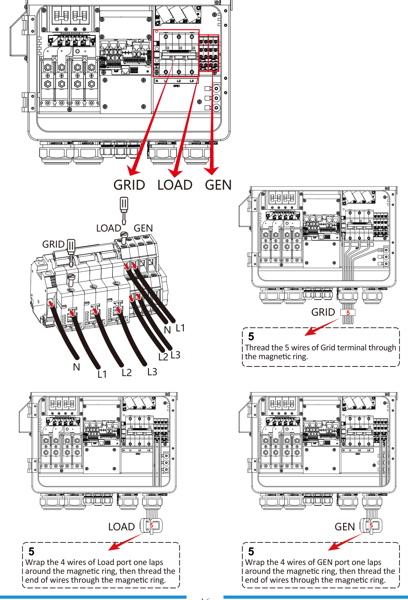

📌 **Popis:** Celostránkové schéma připojení silových AC svorek. Nahoře nákres vnitřku měniče se třemi červenými šipkami k popiskům **GRID**, **LOAD** a **GEN** — ukazuje pořadí svorkovnic zleva doprava. Uprostřed vlevo perspektivní detail svorkovnicového bloku se šroubovákem a s vyvedenými vodiči popsanými **N, L1, L2, L3** pro každou ze tří skupin. Zbylé tři panely ukazují průchodky s feritovými kroužky a instrukce: **GRID** — „Thread the 5 wires of Grid terminal through the magnetic ring"; **LOAD** — „Wrap the 4 wires of Load port one laps around the magnetic ring, then thread the end of wires through the magnetic ring"; **GEN** — totéž pro 4 vodiče GEN portu. Pozor na rozdíl: GRID má **5** vodičů (N+L1+L2+L3+PE), LOAD a GEN po **4**.

> ⚠️ Be sure that AC power source is disconnected before attempting to wire it to the unit.

3. Then, insert AC output wires according to polarities indicated on the terminal block and tighten terminal. Be sure to connect corresponding N wires and PE wires to related terminals as well.
4. Make sure the wires are securely connected.
5. Appliances such as air conditioner are required at least 2–3 minutes to restart because it is required to have enough time to balance refrigerant gas inside of circuit. If a power shortage occurs and recovers in short time, it will cause damage to your connected appliances. To prevent this kind of damage, please check manufacturer of air conditioner if it is equipped with time-delay function before installation. Otherwise, this inverter will trigger overload fault and cut off output to protect your appliance but sometimes it still causes internal damage to the air conditioner.

### 3.6 PV Connection

Before connecting to PV modules, please install a separately DC circuit breaker between inverter and PV modules. It is very important for system safety and efficient operation to use appropriate cable for PV module connection. To reduce risk of injury, please use the proper recommended cable size as below.

**Chart 3-4 Cable size**

| Model | Wire Size | Cable (mm²) |
|---|---|---|
| 14/15/16/18/20 kW | 12 AWG | 2,5 |

> ⚠️ To avoid any malfunction, do not connect any PV modules with possible current leakage to the inverter. For example, grounded PV modules will cause current leakage to the inverter. When using PV modules, please ensure the PV+ & PV− of solar panel is not connected to the system ground bar.
>
> ⚠️ It is requested to use PV junction box with surge protection. Otherwise it will cause damage on inverter when lightning occurs on PV modules.

#### 3.6.1 PV Module Selection

When selecting proper PV modules, please be sure to consider below parameters:

1. Open circuit Voltage (Voc) of PV modules not exceeds max. PV array open circuit voltage of inverter.
2. Open circuit Voltage (Voc) of PV modules should be higher than min. start voltage.
3. The PV modules used to connected to this inverter shall be Class A rating certified according to **IEC 61730**.

**Chart 3-5**

| Inverter Model | 14 kW | 15 kW | 16 kW | 18 kW | 20 kW |
|---|---|---|---|---|---|
| PV Input Voltage (V) | 550 V (160V–800V) | ← | ← | ← | ← |
| PV Array MPPT Voltage Range (V) | 160V–650V | ← | ← | ← | ← |
| No. of MPP Trackers | 2 | 2 | 2 | 2 | 2 |
| No. of Strings per MPP Tracker | 2+2 | 2+2 | 2+2 | 2+2 | 2+2 |

#### 3.6.2 PV Module Wire Connection

1. Switch the Grid Supply Main Switch (AC) OFF.
2. Switch the DC Isolator OFF.
3. Assemble PV input connector to the inverter.

> ⚠️ **Safety Hint:** When using PV modules, please ensure the PV+ & PV− of solar panel is not connected to the system ground bar.
>
> ⚠️ **Safety Hint:** Before connection, please make sure the polarity of the output voltage of PV array matches the "DC+" and "DC−" symbols.
>
> ⚠️ **Safety Hint:** Before connecting inverter, please make sure the PV array open circuit voltage is within the 800 V of the inverter.

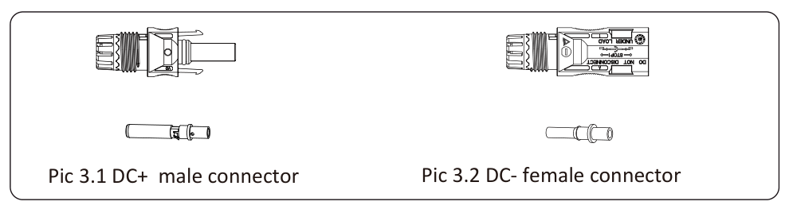

📌 **Popis:** Dvě políčka s perokresbou solárních konektorů v řezu i pohledu — vlevo **Pic 3.1 DC+ male connector**, vpravo **Pic 3.2 DC− female connector**. Pod každým je zobrazen samostatný kovový krimpovací kontakt (pin), který se do konektoru vkládá.

> ⚠️ **Safety Hint:** Please use approved DC cable for PV system.

The steps to assemble the DC connectors are listed as follows:

**a)** Strip off the DC wire about **7 mm**, disassemble the connector cap nut (see picture 3.3).

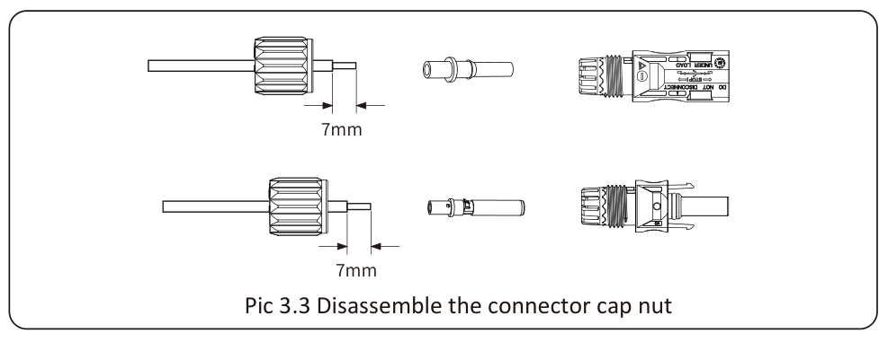

📌 **Popis:** Dvě řady perokreseb (horní pro DC+, dolní pro DC−). Zleva doprava: odizolovaný vodič s kótou **7 mm**, samotný krimpovací kontakt, a rozložený konektor s převlečnou maticí.

**b)** Crimping metal terminals with crimping pliers as shown in picture 3.4.

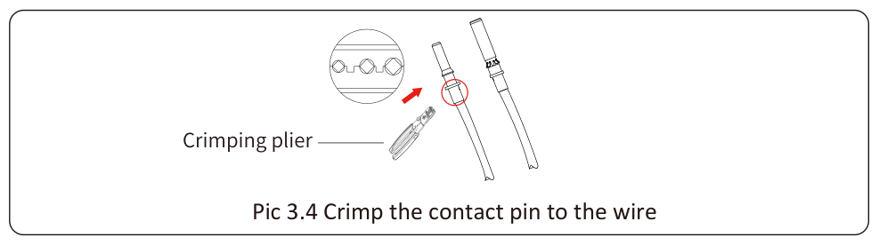

📌 **Popis:** Perokresba krimpovacích kleští (popisek „Crimping plier") s červenou šipkou k místu krimpu na kontaktu nasazeném na vodiči.

**c)** Insert the contact pin to the top part of the connector and screw up the cap nut to the top part of the connector (as shown in picture 3.5).

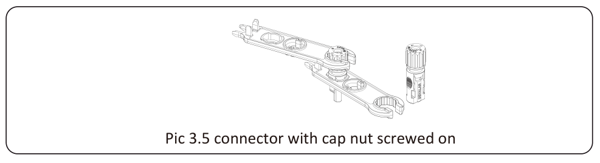

📌 **Popis:** Perokresba hotového konektoru v šikmém pohledu s dotaženou převlečnou maticí, vedle samostatný kontaktní pin pro srovnání.

**d)** Finally insert the DC connector into the positive and negative input of the inverter, shown as picture 3.6.

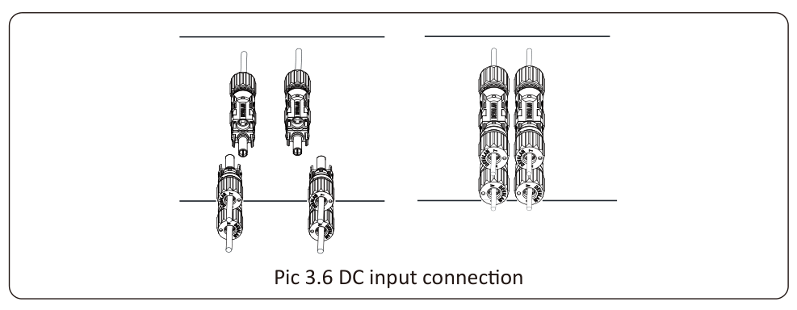

📌 **Popis:** Dvě skupiny konektorů znázorňující osazení DC vstupů měniče — vlevo pohled na zapojené páry, vpravo detail nasazených konektorů v řadě. Odpovídá dvěma MPPT vstupům, každý se dvěma stringy.

> ⚠️ **Warning:** Sunlight shines on the panel will generate voltage, high voltage in series may cause danger to life. Therefore, before connecting the DC input line, the solar panel needs to be blocked by the opaque material and the DC switch should be 'OFF', otherwise, the high voltage of the inverter may lead to life-threatening conditions.
>
> ⚠️ **Warning:** Please use its own DC power connector from the inverter accessories. Do not interconnect the connectors of different manufacturers. **Max. DC input current should be 20 A.** If it exceeds, it may damage the inverter and it is not covered by Deye warranty.

### 3.7 CT Connection

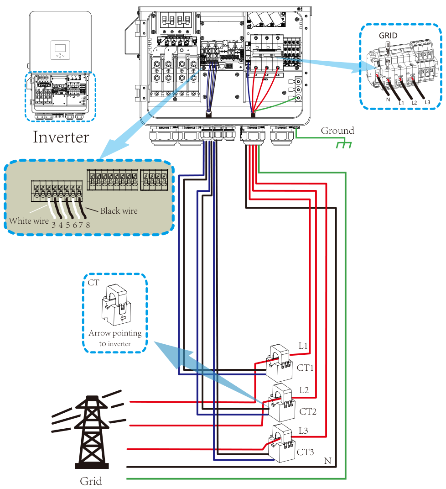

📌 **Popis:** Schéma zapojení tří CT. Vlevo nahoře malý měnič s modře zvýrazněnou spodní částí, vpravo velký nákres vnitřku s modrou výnosovou šipkou do detailu svorkovnice **CN1** (vlevo dole, béžové pole) a druhou šipkou do detailu **GRID** svorkovnice s vodiči L1/L2/L3 (vpravo nahoře). Uprostřed dole tři rozevírací proudové kleště nasazené na třech fázových vodičích, které vedou od stožáru distribuční sítě (vlevo dole, symbol vysokého napětí) k rozvaděči. Modré a červené vodiče od CT vedou zpět do měniče. Zelený vodič je PE.

> **\*Note:** when the reading of the load power on the LCD is not correct, please reverse the CT arrow.

#### 3.7.1 Meter Connection

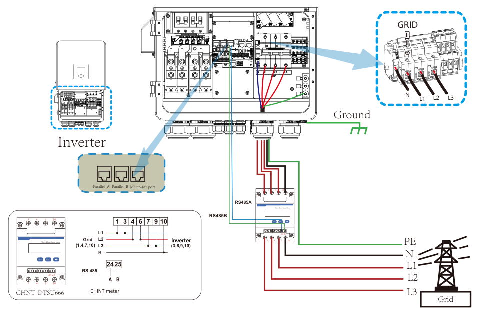

📌 **Popis (horní varianta):** Zapojení s elektroměrem **CHNT**. Vlevo dole schéma svorek elektroměru: svorky **1,4,7,10** jsou Grid (L1/L2/L3), svorky **3,6,9,10** jsou Inverter, svorky **24/25** jsou RS-485 (A/B). Od měniče vede RS485A/RS485B do elektroměru, dále přes proudové transformátory k síti (symbol stožáru vpravo). Vpravo nahoře modře orámovaný detail **GRID** svorkovnice.

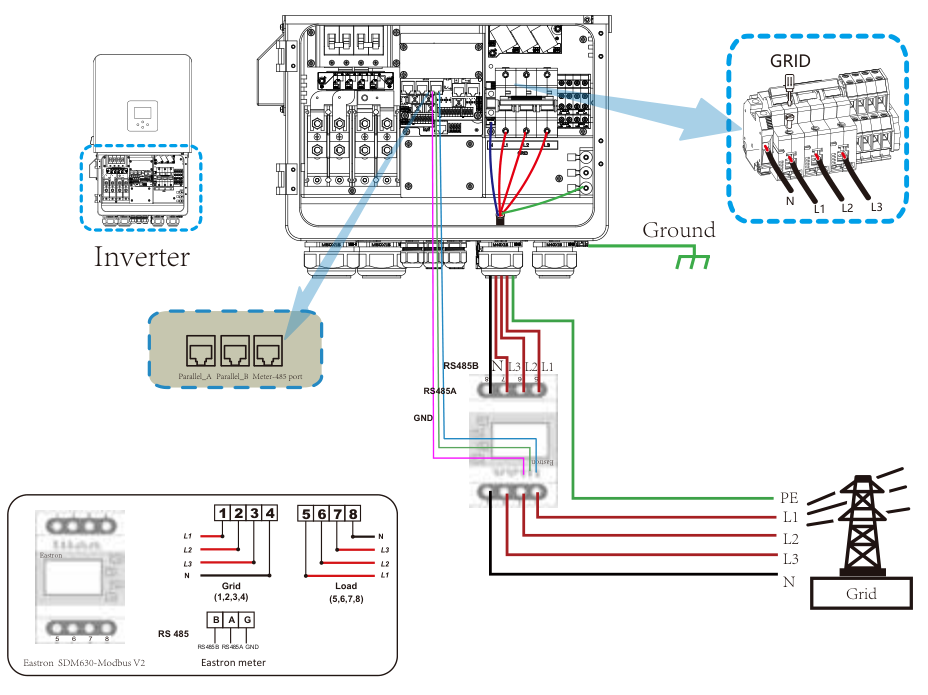

📌 **Popis (spodní varianta):** Totéž s elektroměrem **Eastron**. Schéma svorek: **1,2,3,4** Grid, **5,6,7,8** Load, plus RS-485 svorky A/B. Rozdíl proti CHNT je v číslování svorek a v tom, že Eastron má oddělené skupiny Grid a Load.

> ⚠️ **Note:** When the inverter is in the off-grid state, **the N line needs to be connected to the earth.**

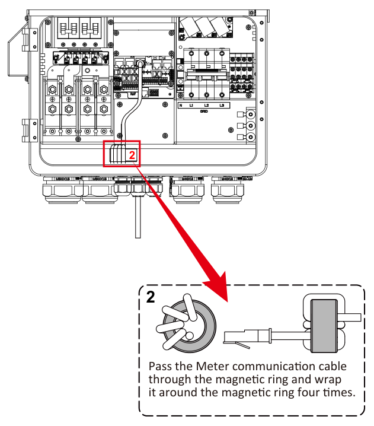

📌 **Popis:** Nákres vnitřku měniče s červeně orámovanou svorkou a červenou šipkou do detailu (2): „Pass the Meter communication cable through the magnetic ring and wrap it around the magnetic ring **four times**."

### 3.8 Earth Connection (mandatory)

Ground cable shall be connected to ground plate on grid side, this prevents electric shock if the original protective conductor fails.

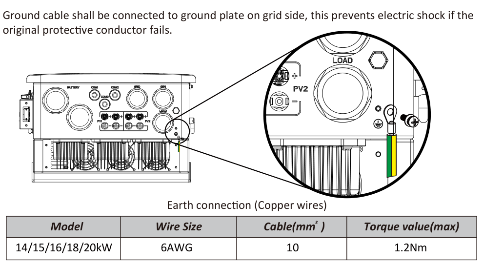

📌 **Popis:** Vlevo pohled zespodu na měnič s vyznačeným zemnicím bodem. Vpravo kruhový detail spodního pravého rohu skříně — zemnicí šroub se žlutozeleným vodičem přišroubovaným k tělu skříně, vedle popisky **LOAD** a **PV2**. Toto je „grounding screw hole in the lower right corner" zmiňovaný ve schématu 3.11.

Earth connection (Copper wires):

| Model | Wire Size | Cable (mm²) | Torque value (max) |
|---|---|---|---|
| 14/15/16/18/20 kW | 6 AWG | 10 | 1,2 Nm |

Earth connection (Copper wires) (bypass):

| Model | Wire Size | Cable (mm²) | Torque value (max) |
|---|---|---|---|
| 14/15/16/18/20 kW | 4 AWG | 16 | 1,2 Nm |

> ⚠️ **Warning:** Inverter has built-in leakage current detection circuit. The **type A RCD** can be connected to the inverter for protection according to the local laws and regulations. If an external leakage current protection device is connected, its operating current **must be equal to 300 mA or higher**, otherwise inverter may not work properly.

### 3.9 WIFI Connection

For the configuration of Wi-Fi Plug, please refer to illustrations of the Wi-Fi Plug. The Wi-Fi Plug is not a standard configuration, it's optional.

### 3.10 Wiring System for Inverter

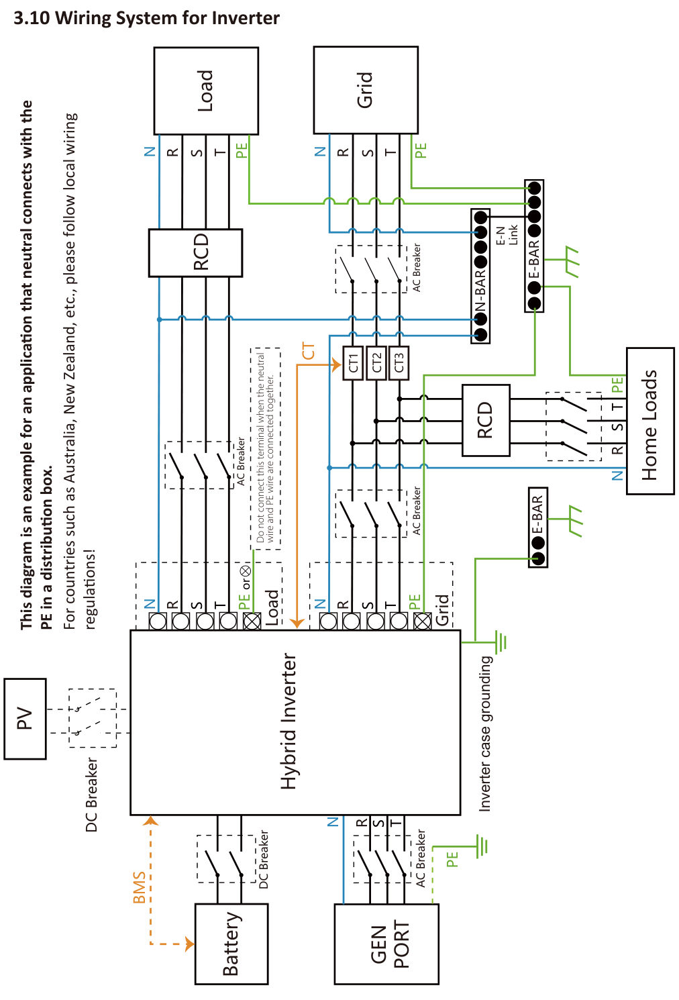

📌 **Popis:** Celostránkové jednopólové schéma otočené o 90°. Svislý text vlevo uvádí: *„This diagram is an example for an application that neutral connects with the PE in a distribution box. For countries such as Australia, New Zealand, etc., please follow local wiring regulations!"* — tedy varianta, kde je **N spojený s PE** v rozvaděči.
>
> Uprostřed dole blok **Hybrid Inverter** se svorkami zleva: **Load** (N, R, S, T, PE), **Grid** (N, R, S, T, PE) a dole **GEN PORT** a **Battery**. Vlevo **PV** přes **DC Breaker**, k baterii vede oranžová čárkovaná linka **BMS**. Nahoře bloky **Load** a **Grid**, mezi nimi **RCD** (proudový chránič) a **AC Breaker**, dále **N-BAR** (nulová přípojnice) s propojkou **E-N Link** na **E-BAR** (zemnicí přípojnice) se symbolem uzemnění. Vpravo **Home Loads** přes vlastní RCD. Oranžová linka **CT** vede k trojici **CT1/CT2/CT3** na přívodu od sítě. Zelené vodiče jsou PE, modré N, černé fáze.

### 3.11 Wiring diagram

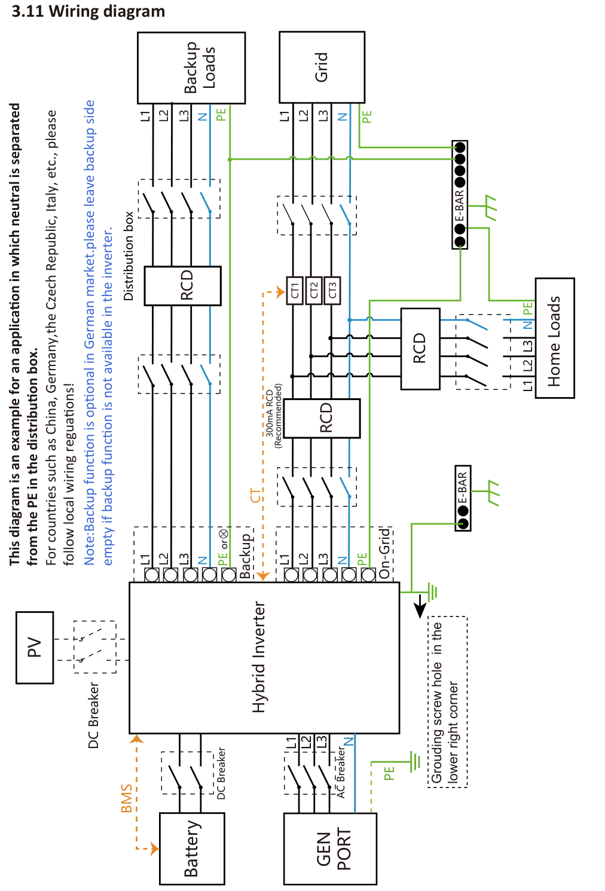

📌 **Popis:** ⭐ **Pro české instalace klíčové schéma.** Celostránkové jednopólové schéma otočené o 90°. Svislý text vlevo uvádí doslova: *„This diagram is an example for an application in which neutral is separated from the PE in the distribution box. For countries such as China, Germany, **the Czech Republic**, Italy, etc., follow local wiring regulations!"* — tedy varianta pro **TN-S**, kde je N oddělený od PE. Modrou barvou je připsána poznámka: *„Note: Backup function is optional in German market, please leave backup side empty if backup function is not available in the inverter."*
>
> Uspořádání: uprostřed blok **Hybrid Inverter**, jeho AC svorky jsou označené **Backup** (L1, L2, L3, N, PE) a **On-Grid** (L1, L2, L3, N, PE). Vlevo **PV** přes **DC Breaker**, dole **Battery** přes **DC Breaker** s oranžovou **BMS** linkou a **GEN PORT** přes **AC Breaker**. Nahoře **Backup Loads** a **Grid**. V rozvaděči (**Distribution box**) jsou **tři samostatné RCD**: jeden pro zálohovanou větev, jeden na přívodu a jeden pro **Home Loads**, u prostředního je poznámka **„300mA RCD (Recommended)"**. Vpravo **E-BAR** (zemnicí přípojnice) se symbolem zemniče — **N a PE se nikde nespojují**. Zmíněn je i **„Grounding screw hole in the lower right corner"** pro uzemnění skříně měniče. Trojice **CT1/CT2/CT3** je na přívodu od sítě.

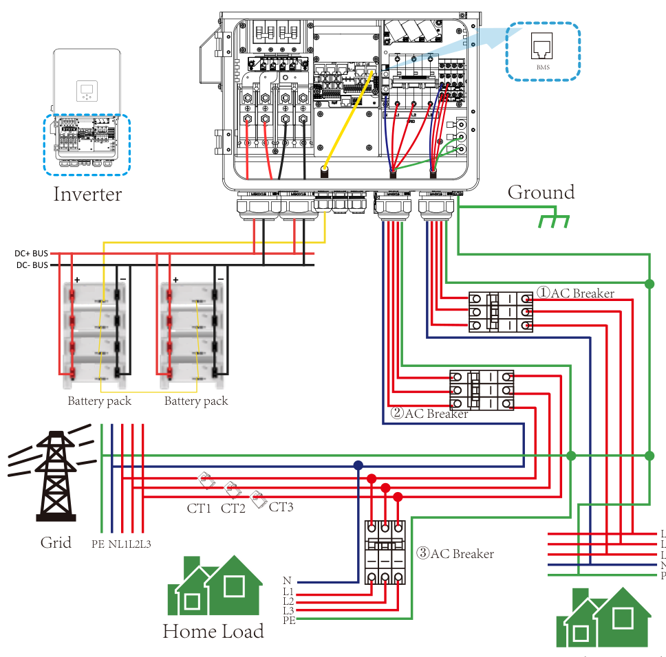

📌 **Popis:** Barevné schéma reálné instalace. Vlevo dva bateriové stacky propojené na **DC+ BUS** a **DC− BUS** (žluté vodiče), vedoucí do měniče. Vpravo od měniče vede vějíř vodičů přes skupiny jističů k dvěma zeleným ikonám domů — tedy **dvě samostatné odběrné větve**. Vlevo dole symbol distribuční sítě (stožár) s pojistkami. Zelené vodiče PE se sbíhají do společné zemnicí přípojnice.

### 3.12 Typical application diagram of diesel generator

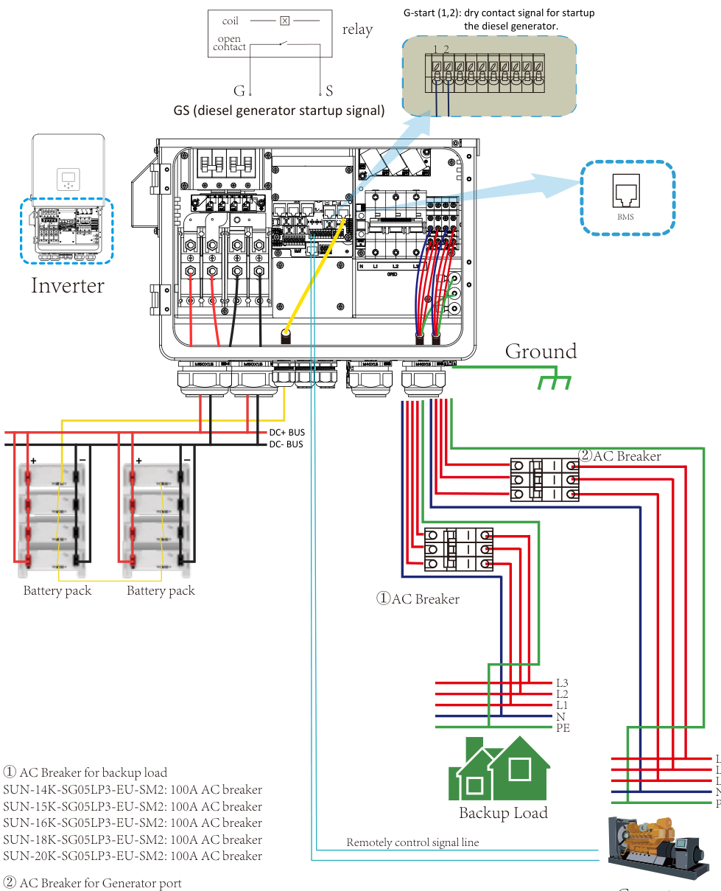

📌 **Popis:** Schéma s generátorem. Nahoře detail svorky **CN2: G-start (1,2) — dry contact signal for startup the diesel generator** a schematická značka **GS (diesel generator startup signal)**. Uprostřed měnič, vlevo dva bateriové stacky na DC+/DC− BUS, vpravo přes jističe zelená ikona domu (zátěž) a vpravo dole fotografie/kresba **dieselagregátu**. Světle modrá linka představuje startovací signál z měniče do generátoru — měnič sám generátor nastartuje, když SOC baterie klesne pod nastavenou mez.

### 3.13 Three phase parallel connection diagram

> **Note:** For the parallel system, please choose the **"Zero export to CT"** mode.

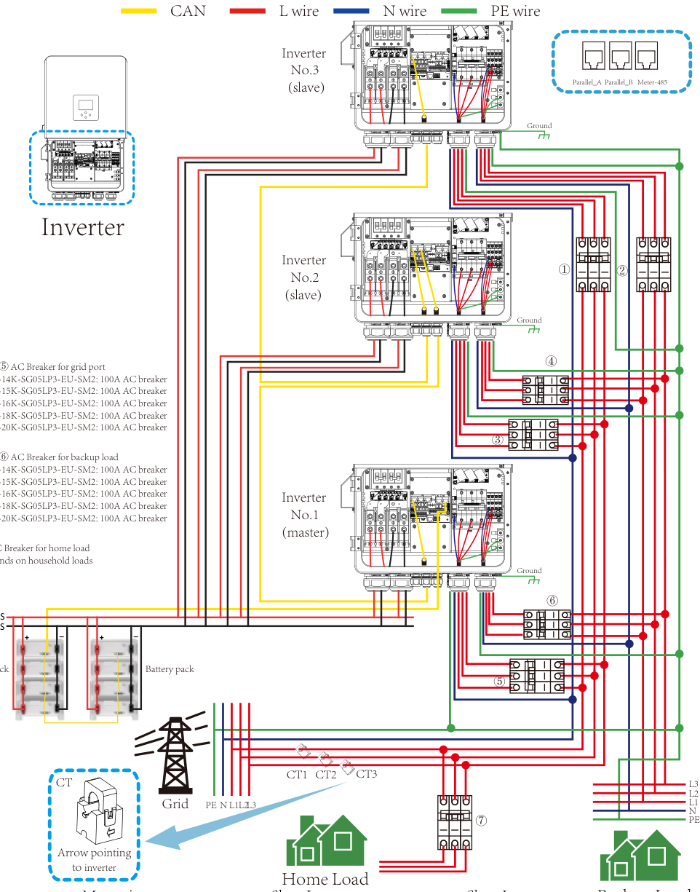

📌 **Popis:** Schéma paralelního zapojení **tří měničů** nad sebou. Každý má vlastní skupinu jističů; jejich AC výstupy jsou svedeny na společnou sběrnici. Vlevo dole dva bateriové stacky na sdílené **DC+ BUS / DC− BUS** — všechny tři měniče sdílejí jednu baterii. Modře orámovaný detail vlevo ukazuje **CT** kleště na přívodu od sítě (stožár). Vpravo dvě zelené ikony domů jako zátěže. Nahoře vpravo modře orámovaný detail tří RJ45 konektorů — paralelní komunikační propojení.

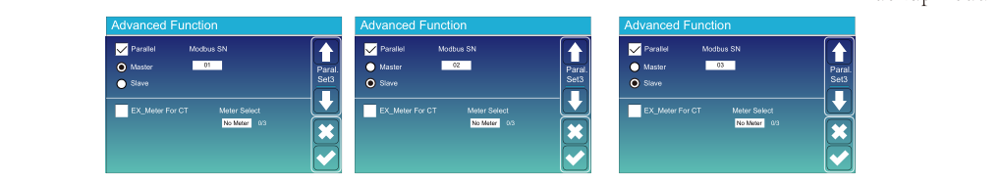

📌 **Popis:** Tři snímky obrazovky **Advanced Function** vedle sebe — nastavení pro každý ze tří měničů. Zaškrtnuto **Parallel**, pole **Modbus SN**, a přepínač **Master / Slave**: první měnič je **Master**, zbylé dva **Slave**. Dole pole **EX_Meter For CT** a **Meter Select**.

---

## 4. Operation

### 4.1 Power ON/OFF

Once the unit has been properly installed and the batteries are connected well, simply press On/Off button (located on the left side of the case) to turn on the unit. When system without battery connected, but connect with either PV or grid, and ON/OFF button is switched off, LCD will still light up (Display will show OFF). In this condition, when switch on ON/OFF button and select NO battery, system can still working.

### 4.2 Operation and Display Panel

The operation and display panel, shown in below chart, is on the front panel of the inverter. It includes four function keys and a LCD display, indicating the operating status and input/output power information.

**Chart 4-1 LED indicators**

| LED Indicator | Messages |
|---|---|
| Red led solid light | Malfunction |
| Blue led solid light | Inverter operating normal |
| No light emission | Not powered on or warning |

**Chart 4-2 Function Buttons**

| Function Key | Description |
|---|---|
| Esc | To exit setting mode |
| Up | To go to previous selection |
| Down | To go to next selection |
| Enter | To confirm the selection |

---

## 5. LCD Display Icons

### 5.1 Main Screen

The LCD is touchscreen, below screen shows the overall information of the inverter.

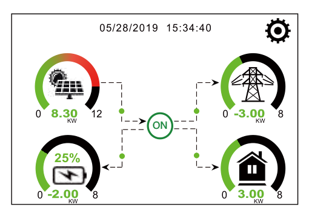

📌 **Popis:** Hlavní obrazovka měniče. Čtyři kruhové ukazatele v rozích, každý s barevným obloukem (zelená → červená podle zatížení) a číselnou hodnotou v kW: vlevo nahoře **PV** (8.30 kW, rozsah 0–12), vpravo nahoře **síť** (−3.00 kW, rozsah 0–8), vlevo dole **baterie** (−2.00 kW, SOC **25 %**, rozsah 0–8), vpravo dole **zátěž/dům** (3.00 kW, rozsah 0–8). Uprostřed zelené kolečko **ON** propojené s ukazateli tečkovanými čarami, které znázorňují směr toku energie. Nahoře datum a čas (05/28/2019 15:34:40), vpravo nahoře ozubené kolo pro vstup do nastavení.

1. The icon in the center of the home screen indicates that the system is Normal operation. If it turns into "comm./F01~F64", it means the inverter has communication errors or other errors, the error message will display under this icon (F01–F64 errors, detail error info can be viewed in the System Alarms menu).
2. At the top of the screen is the time.
3. System Setup Icon — press this set button, you can enter into the system setup screen which including Basic Setup, Battery Setup, Grid Setup, System Work Mode, Generator port use, Advanced function and Li-Batt info.
4. The main screen showing the info including Solar, Grid, Load and Battery. It also displaying the energy flow direction by arrow. When the power is approximate to high level, the color on the panels will changing from green to red so system info showing vividly on the main screen.

- PV power and Load power always keep positive.
- **Grid power negative means sell to grid, positive means get from grid.**
- **Battery power negative means charge, positive means discharge.**

#### 5.1.1 LCD operation flow chart

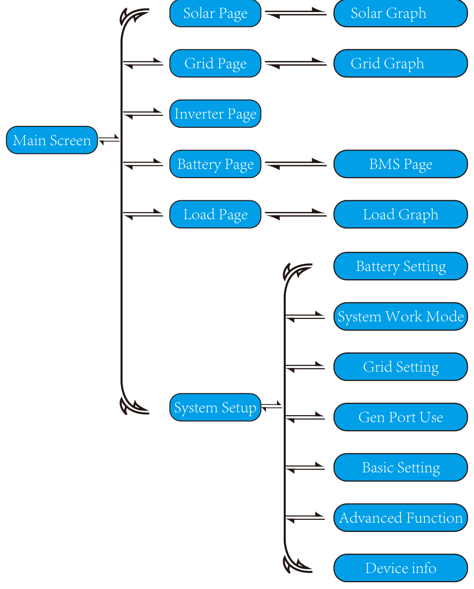

📌 **Popis:** Stromový diagram struktury menu — modré zaoblené obdélníky propojené šipkami. Vlevo kořen **Main Screen**, z něj vede šest větví na druhou úroveň: **Solar Page**, **Grid Page**, **Inverter Page**, **BMS Page**, **Battery Page**, **Load Page** (první, druhá, čtvrtá a pátá mají navazující grafovou stránku vpravo — Solar Graph, Grid Graph, Load Graph). Poslední větev **System Setup** se rozvětvuje na sedm položek: **Battery Setting**, **System Work Mode**, **Grid Setting**, **Gen Port Use**, **Basic Setting**, **Advanced Function**, **Device Info**. *(Pozn.: v PDF jsou boxy vyplněné plnou modrou bez textu — popisky jsou zde doplněné podle skutečné struktury menu popsané v kapitolách 5.2–5.11.)*

### 5.2 Solar Power Curve

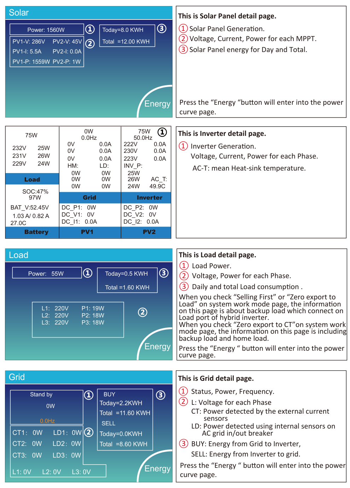

📌 **Popis:** Čtyři snímky obrazovky s vysvětlujícím textem vpravo:
>
> - **Solar** — ① Solar Panel Generation (Power: 1560 W), ② napětí, proud a výkon pro každý MPPT (PV1-V: 286 V, PV1-I: 5.5 A, PV1-P: 1559 W; PV2-V: 45 V, PV2-I: 0.0 A, PV2-P: 1 W), ③ denní a celková výroba (Today = 8.0 kWh, Total = 12.00 kWh).
> - **Inverter** — ① výroba měniče; napětí, proud a výkon pro každou fázi; **AC_T** = teplota chladiče (49.9 °C). Stránka je rozdělená na pásy **Load / Grid / Inverter** a **Battery / PV1 / PV2**.
> - **Load** — ① výkon zátěže (55 W), ② napětí a výkon pro každou fázi (L1: 220 V P1: 19 W, L2: 220 V P2: 18 W, L3: 220 V P3: 18 W), ③ denní a celková spotřeba.
> - **Grid** — ① stav, výkon, frekvence, ② napětí pro každou fázi; **CT** = výkon změřený externími proudovými transformátory, **LD** = výkon změřený interními senzory na AC jističi, ③ **BUY** (energie ze sítě do měniče) a **SELL** (energie z měniče do sítě).

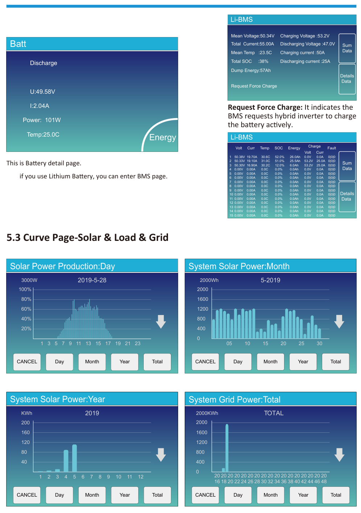

📌 **Popis:** Nahoře vlevo stránka **Batt** (Discharge, U: 49.58 V, I: 2.04 A, Power: 101 W, Temp: 25.0 °C). Vpravo dvě stránky **Li-BMS**: souhrnná (**Sum Data** — Mean Voltage 50.34 V, Total Current 55.00 A, Mean Temp 23.5 °C, Total SOC 38 %, Charging Voltage 53.2 V, Discharging Voltage 47.0 V, Charging current 50 A, Discharging current 25 A, **Request Force Charge**) a detailní (**Details Data**) s tabulkou po jednotlivých bateriových modulech.
>
> **Request Force Charge:** It indicates the BMS requests hybrid inverter to charge the battery actively.
>
> Dole **5.3 Curve Page — Solar & Load & Grid**: čtyři sloupcové grafy — **Solar Power Production: Day** (po hodinách), **System Solar Power: Month** (po dnech), **System Solar Power: Year** (po měsících) a **System Grid Power: Total** (po letech). Každý má dole tlačítka **CANCEL / Day / Month / Year / Total** a šipku pro listování.

Solar power curve for daily, monthly, yearly and total can be roughly checked on the LCD. For more accuracy power generation, pls check on the monitoring system. Click the up and down arrow to check power curve of different period.

### 5.4 System Setup Menu / 5.5 Basic Setup Menu

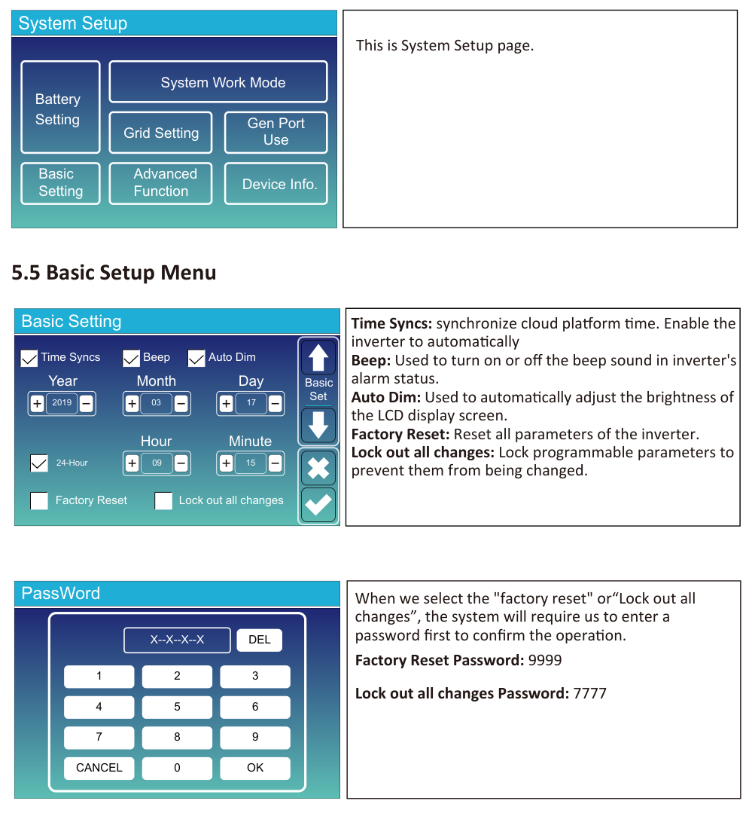

📌 **Popis:** Nahoře obrazovka **System Setup** s osmi dlaždicemi: Battery Setting, System Work Mode, Grid Setting, Gen Port Use, Basic Setting, Advanced Function, Device Info. Uprostřed obrazovka **Basic Setting** se zaškrtávacími poli **Time Syncs**, **Beep**, **Auto Dim**, nastavením data a času (Year / Month / Day / Hour / Minute), přepínačem 24-Hour a poli **Factory Reset** a **Lock out all changes**. Dole číselná klávesnice **PassWord**.

- **Time Syncs:** synchronize cloud platform time. Enable the inverter to automatically.
- **Beep:** Used to turn on or off the beep sound in inverter's alarm status.
- **Auto Dim:** Used to automatically adjust the brightness of the LCD display screen.
- **Factory Reset:** Reset all parameters of the inverter. — **Password: 9999**
- **Lock out all changes:** Lock programmable parameters to prevent them from being changed. — **Password: 7777**

### 5.6 Battery Setup Menu

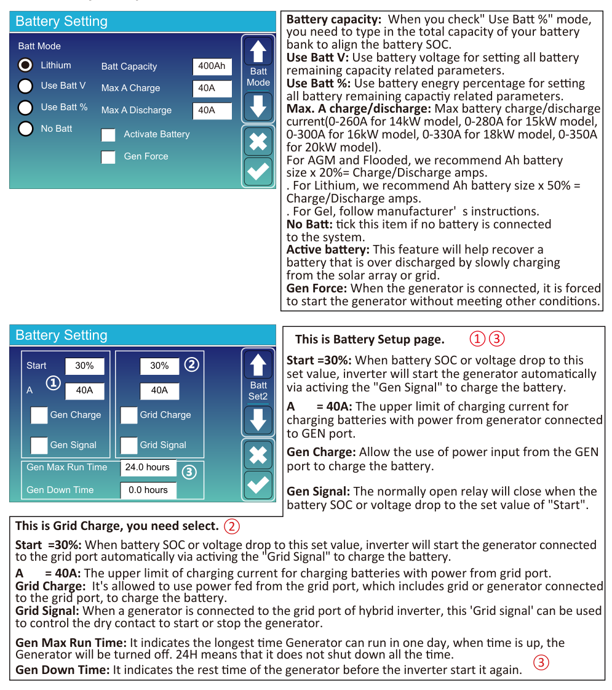

📌 **Popis:** Dvě obrazovky **Battery Setting**. První (**Batt Mode**) s přepínači režimu **Lithium / Use Batt V / Use Batt % / No Batt** a poli **Batt Capacity** (400 Ah), **Max A Charge** (40 A), **Max A Discharge** (40 A), plus zaškrtávátka **Activate Battery** a **Gen Force**. Druhá (**Batt Set2**) s poli **Start 30 %**, **A 40 A** ve dvou sloupcích, zaškrtávátky **Gen Charge / Gen Signal** a **Grid Charge / Grid Signal**, a poli **Gen Max Run Time** (24.0 hours) a **Gen Down Time** (0.0 hours).

- **Battery capacity:** When you check "Use Batt %" mode, you need to type in the total capacity of your battery bank to align the battery SOC.
- **Use Batt V:** Use battery voltage for setting all battery remaining capacity related parameters.
- **Use Batt %:** Use battery energy percentage for setting all battery remaining capacity related parameters.
- **Max. A charge/discharge:** Max battery charge/discharge current (0–260 A for 14 kW model, 0–280 A for 15 kW model, 0–300 A for 16 kW model, 0–330 A for 18 kW model, 0–350 A for 20 kW model).
- For **AGM** and **Flooded**, we recommend Ah battery size ×20% = Charge/Discharge amps. For **Lithium**, we recommend Ah battery size ×50% = Charge/Discharge amps. For **Gel**, follow manufacturer's instructions.
- **No Batt:** tick this item if no battery is connected to the system.
- **Active battery:** This feature will help recover a battery that is over discharged by slowly charging from the solar array or grid.
- **Gen Force:** When the generator is connected, it is forced to start the generator without meeting other conditions.
- **Start = 30%:** When battery SOC or voltage drop to this set value, inverter will start the generator automatically via activating the "Gen Signal" to charge the battery.
- **A = 40A:** The upper limit of charging current for charging batteries with power from generator connected to GEN port.
- **Gen Charge:** Allow the use of power input from the GEN port to charge the battery.
- **Gen Signal:** The normally open relay will close when the battery SOC or voltage drop to the set value of "Start".
- **Grid Charge:** It's allowed to use power fed from the grid port, which includes grid or generator connected to the grid port, to charge the battery.
- **Grid Signal:** When a generator is connected to the grid port of hybrid inverter, this 'Grid signal' can be used to control the dry contact to start or stop the generator.
- **Gen Max Run Time:** It indicates the longest time Generator can run in one day, when time is up, the Generator will be turned off. 24H means that it does not shut down all the time.
- **Gen Down Time:** It indicates the rest time of the generator before the inverter start it again.

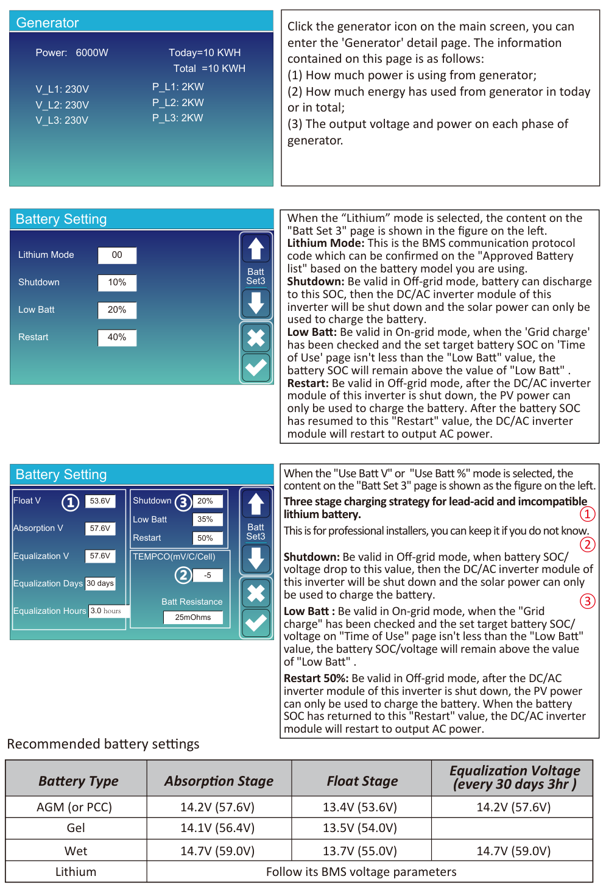

📌 **Popis:** Nahoře stránka **Generator** (Power: 6000 W, V_L1/L2/L3: 230 V, P_L1/L2/L3: 2 kW, Today = 10 kWh, Total = 10 kWh). Uprostřed **Battery Setting / Batt Set3** pro lithium: **Lithium Mode 00**, **Shutdown 10 %**, **Low Batt 20 %**, **Restart 40 %**. Dole druhá varianta **Batt Set3** pro olověné baterie s poli **Float V 53.6 V**, **Absorption V 57.6 V**, **Equalization V 57.6 V**, **Equalization Days 30 days**, **Equalization Hours 3.0**, **Shutdown 20 %**, **Restart 50 %**, **TEMPCO −5 mV/°C/Cell** a **Batt Resistance 25 mOhms**.

- **Lithium Mode:** This is the BMS communication protocol code which can be confirmed on the "Approved Battery list" based on the battery model you are using.
- **Shutdown:** Be valid in Off-grid mode, when battery SOC or voltage drop to this SOC, then the DC/AC inverter module of this inverter will be shut down and the solar power can only be used to charge the battery.
- **Low Batt:** Be valid in On-grid mode, when the "Grid charge" has been checked and the set target battery SOC on "Time of Use" page isn't less than the "Low Batt" value, the battery SOC will remain above the value of "Low Batt".
- **Restart:** Be valid in Off-grid mode, after the DC/AC inverter module of this inverter is shut down, the PV power can only be used to charge the battery. After the battery SOC has resumed to this "Restart" value, the DC/AC inverter module will restart to output AC power.

**Recommended battery settings**

| Battery Type | Absorption Stage | Float Stage | Equalization Voltage (every 30 days 3 hr) |
|---|---|---|---|
| AGM (or PCC) | 14.2 V (57.6 V) | 13.4 V (53.6 V) | 14.2 V (57.6 V) |
| Gel | 14.1 V (56.4 V) | 13.5 V (54.0 V) | — |
| Wet | 14.7 V (59.0 V) | 13.7 V (55.0 V) | 14.7 V (59.0 V) |
| Lithium | Follow its BMS voltage parameters | | |

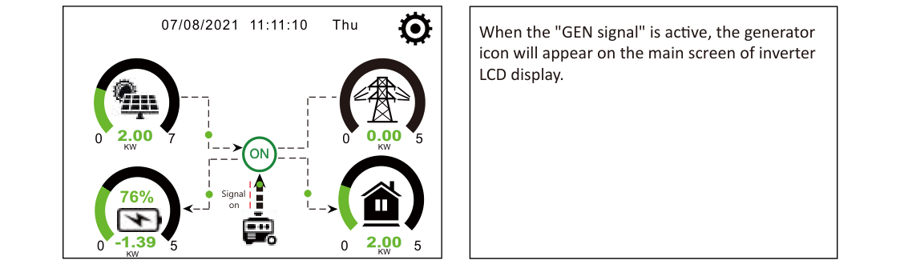

📌 **Popis:** Hlavní obrazovka LCD ve stavu, kdy je aktivní **GEN signal** — vlevo dole u bateriového ukazatele přibyl nápis **Signal on** a v dolní části obrazovky se objevila ikona generátoru. Text vpravo: *„When the 'GEN signal' is active, the generator icon will appear on the main screen of inverter LCD display."*

### 5.7 System Work Mode Setup Menu

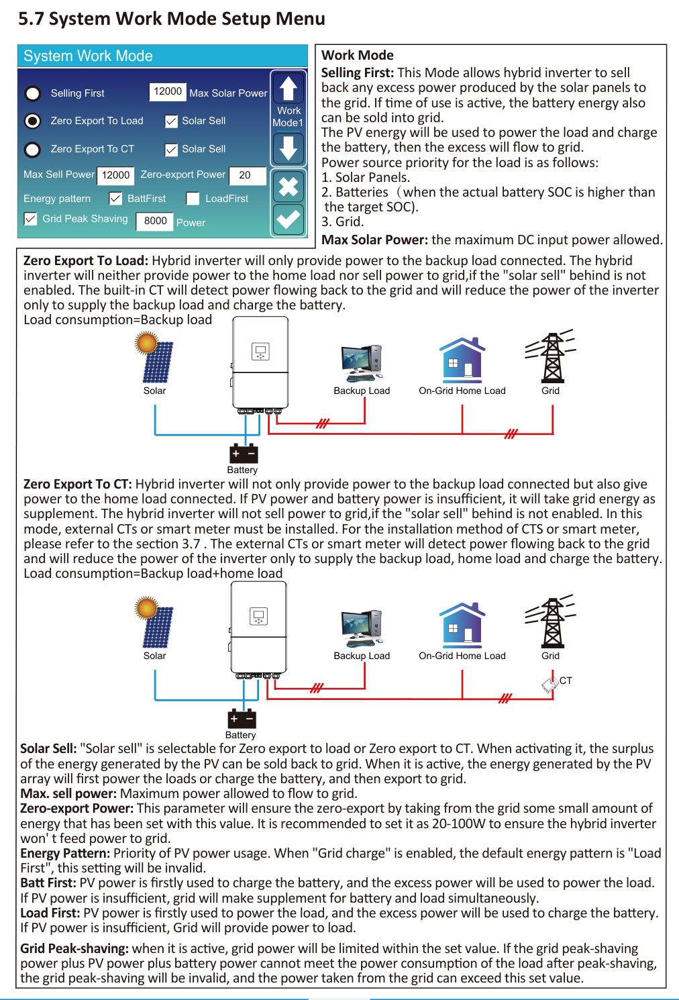

📌 **Popis:** Celostránkový výklad. Nahoře obrazovka **System Work Mode** s přepínači **Selling First / Zero Export To Load / Zero Export To CT**, zaškrtávátky **Solar Sell**, poli **Max Sell Power** (12000), **Zero-export Power** (20), **Max Solar Power** (12000), přepínačem **Energy pattern: BattFirst / LoadFirst** a **Grid Peak Shaving** (8000 W). Uprostřed dvě blokové schémata: **Zero Export To Load** — měnič napájí jen Backup Load, šrafované značky „//" přerušují tok k On-Grid Home Load i ke Grid; **Zero Export To CT** — měnič napájí Backup Load i On-Grid Home Load, značka „//" je jen na vedení ke Grid, a na přívodu od sítě je symbol **CT**.

**Work Mode**

- **Selling First:** This Mode allows hybrid inverter to sell back any excess power produced by the solar panels to the grid. If time of use is active, the battery energy also can be sold into grid. The PV energy will be used to power the load and charge the battery, then the excess energy will flow to grid. Power source priority for the load is as follows: 1. Solar Panels. 2. Batteries (when the actual battery SOC is higher than the target SOC). 3. Grid.
- **Max Solar Power:** the maximum DC input power allowed.
- **Zero Export To Load:** Hybrid inverter will only provide power to the backup load connected. The hybrid inverter will neither provide power to the home load nor sell power to grid, if the "solar sell" is not enabled. The built-in CT will detect power flowing back to the grid and will reduce the power of the inverter only to supply the backup load and charge the battery. **Load consumption = Backup load**
- **Zero Export To CT:** Hybrid inverter will not only provide power to the backup load connected but also give power to the home load connected. If PV power and battery power is insufficient, it will take grid energy as supplement. The hybrid inverter will not sell power to grid, if the "solar sell" is not enabled. In this mode, external CTs or smart meter must be installed. For the installation method of CTs or smart meter, please refer to the section 3.7. The external CTs or smart meter will detect power flowing back to the grid and will reduce the power of the inverter only to supply the backup load, home load and charge the battery. **Load consumption = Backup load + home load**
- **Solar Sell:** "Solar sell" is selectable for Zero export to load or Zero export to CT. When activating it, the surplus of the energy generated by the PV can be sold back to grid. When it is active, the energy generated by the PV array will firstly power the loads, and then export to grid.
- **Max. sell power:** Maximum power allowed to flow to grid.
- **Zero-export Power:** This parameter will ensure the zero-export by taking from the grid some small amount of energy that has been set with this value. It is recommended to set it as **20–100 W** to ensure the hybrid inverter won't feed power to grid.
- **Energy Pattern:** Priority of PV power usage. When "Grid charge" is enabled, the default energy pattern is "Load First", this setting will be invalid.
  - **Batt First:** PV power is firstly used to charge the battery, and the excess power will be used to power the load. If PV power is insufficient, grid will make supplement for battery and load simultaneously.
  - **Load First:** PV power is firstly used for the load, and the excess power will be used to charge the battery. If PV power is insufficient, grid will provide power to load.
- **Grid Peak-shaving:** when it is active, grid power will be limited within the set value. If the grid peak-shaving power plus PV power plus battery power cannot meet the power consumption of the load after grid peak-shaving, the grid peak-shaving will be invalid, and the power taken from the grid can exceed this set value.

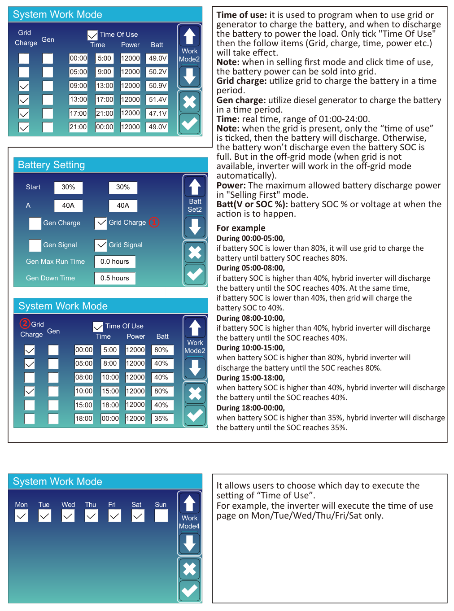

📌 **Popis:** Tři obrazovky. Nahoře **System Work Mode / Work Mode2** s tabulkou **Time Of Use** — šest řádků, každý se sloupci **Grid Charge**, **Gen**, **Time** (00:00, 05:00, 09:00, 13:00, 17:00, 21:00), **Power** (12000) a **Batt** (49.0 V, 50.2 V, 50.9 V, 51.4 V, 47.1 V, 49.0 V), se zaškrtávacími poli pro Grid Charge u vybraných řádků. Uprostřed **Battery Setting / Batt Set2**. Dole **Work Mode2** s variantou v procentech SOC (80 %, 40 %, 40 %, 80 %, 40 %, 35 %) a úplně dole **Work Mode4** — výběr dnů v týdnu **Mon / Tue / Wed / Thu / Fri / Sat / Sun**.

- **Time of use:** it is used to program when to use grid or generator to charge the battery, and when to discharge the battery to power the load. Only tick "Time Of Use" then the follow items (Grid charge, time, power etc.) will take effect.
- **Note:** when in selling first mode and click time of use, the battery power can be sold into grid.
- **Grid charge:** utilize grid to charge the battery in a time period.
- **Gen charge:** utilize diesel generator to charge the battery in a time period.
- **Time:** real time, range of 01:00–24:00.
- **Note:** when the grid is present, only the "time of use" is ticked, then the battery will discharge. Otherwise, the battery won't discharge even the battery SOC is full. In the off-grid mode (when grid is not available), inverter will work in the off-grid mode automatically.
- **Power:** The maximum allowed battery discharge power in "Selling First" mode.
- **Batt (V or SOC %):** battery SOC % or voltage at when the action is to happen.

**For example:**

| Období | Chování |
|---|---|
| 00:00–05:00 | if battery SOC is lower than 80%, it will use grid to charge the battery until battery SOC reaches 80%. |
| 05:00–08:00 | if battery SOC is higher than 40%, hybrid inverter will discharge the battery until SOC reaches 40%. At the same time, if battery SOC is lower than 40%, then grid will charge the battery SOC to 40%. |
| 08:00–10:00 | if battery SOC is higher than 40%, hybrid inverter will discharge the battery until the SOC reaches 40%. |
| 10:00–15:00 | when battery SOC is higher than 80%, hybrid inverter will discharge the battery until the SOC reaches 80%. |
| 15:00–18:00 | when battery SOC is higher than 40%, hybrid inverter will discharge the battery until the SOC reaches 40%. |
| 18:00–00:00 | when battery SOC is higher than 35%, hybrid inverter will discharge the battery until the SOC reaches 35%. |

It allows users to choose which day to execute the setting of "Time of Use". For example, the inverter will execute the time of use page on Mon/Tue/Wed/Thu/Fri/Sat only.

### 5.8 Grid Setup Menu

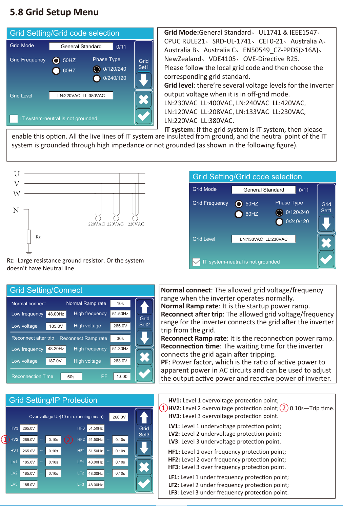

📌 **Popis:** ⭐ Celostránkový výklad nastavení sítě. Nahoře obrazovka **Grid Setting / Grid code selection** s polem **Grid Mode** (General Standard, 0/11), přepínači **Grid Frequency 50HZ / 60HZ**, **Phase Type 0/120/240 / 0/240/120**, polem **Grid Level** (LN:220VAC LL:380VAC) a zaškrtávátkem **„IT system-neutral is not grounded"**. Uprostřed vlevo schéma IT sítě — tři fázové vodiče a uzel uzemněný přes velký odpor **Rz** s poznámkou *„Rz: Large resistance ground resistor. Or the system doesn't have Neutral line"*. Dole obrazovky **Grid Setting/Connect** a **Grid Setting/IP Protection** s prahy přepětí a podpětí.

**Grid Mode — dostupné kódy sítě:** General Standard, UL1741 & IEEE1547, CPUC RULE21, SRD-UL-1741, CEI 0-21, Australia A, Australia B, Australia C, **EN50549_CZ-PPDS (>16A)**, New Zealand, VDE4105, OVE-Directive R25.

> Please follow the local grid code and then choose the corresponding grid standard.

- **Grid level:** there're several voltage levels for the inverter output voltage when it is in off-grid mode: LN:230VAC LL:400VAC · LN:240VAC LL:420VAC · LN:120VAC LL:208VAC · LN:133VAC LL:230VAC · LN:220VAC LL:380VAC.
- **IT system:** If the grid system is IT system, please enable this option. All the live lines of IT system are insulated from ground, and the neutral point of the IT system is grounded through high impedance or not grounded.
- **Normal connect:** The allowed grid voltage/frequency range when the inverter operates normally. (Low frequency 48.00 Hz, High frequency 51.50 Hz, Low voltage 185.0 V, High voltage 265.0 V)
- **Normal Ramp rate:** It is the startup power ramp. (10 s)
- **Reconnect after trip:** The allowed grid voltage/frequency range for the inverter connects the grid after the inverter trip from the grid. (Low frequency 48.20 Hz, High frequency 51.30 Hz, Low voltage 187.0 V, High voltage 263.0 V)
- **Reconnect Ramp rate:** It is the reconnection power ramp. (36 s)
- **Reconnection time:** The waiting time for the inverter connects the grid again after tripping. (60 s)
- **PF:** Power factor, which is the ratio of active power to apparent power in AC circuits and can be used to adjust the output active power of inverter. (1.000)
- **HV1/HV2/HV3:** Level 1/2/3 overvoltage protection point; **HV2** has 010 s—Trip time.
- **LV1/LV2/LV3:** Level 1/2/3 undervoltage protection point.
- **HF1/HF2/HF3:** Level 1/2/3 over frequency protection point.
- **LF1/LF2/LF3:** Level 1/2/3 under frequency protection point.

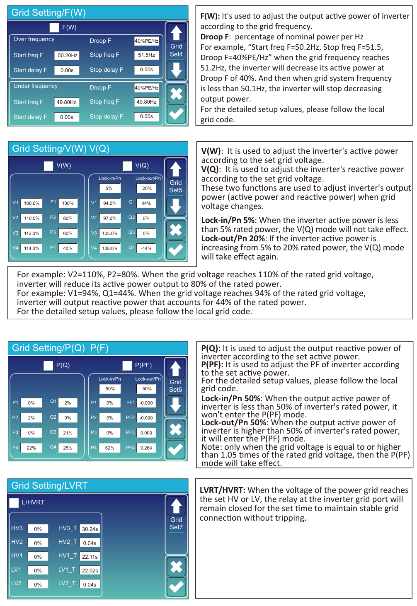

📌 **Popis:** Čtyři obrazovky nastavení chování měniče vůči síti:
>
> - **Grid Setting/F(W)** — **F(W):** It's used to adjust the output active power of inverter according to the grid frequency. **Droop F:** percentage of nominal power per Hz. For example, "Start freq F = 50.2 Hz, Stop freq F = 51.5, Droop F = 40 %PE/Hz" when the grid frequency reaches 51.2 Hz, the inverter will decrease its active power at Droop F of 40 %. And then when the grid system frequency is less than 50.1 Hz, the inverter will stop decreasing output power.
> - **Grid Setting/V(W) V(Q)** — **V(W):** used to adjust the inverter's active power according to the set grid voltage. **V(Q):** used to adjust the inverter's reactive power according to the set grid voltage. **Lock-in/Pn 5 %:** When the inverter active power is less than 5 % rated power, the V(Q) mode will not take effect. **Lock-out/Pn 20 %:** If the inverter active power is increasing from 5 % to 20 % rated power, the V(Q) mode will take effect again. *Příklad:* V2 = 110 %, P2 = 80 % — když napětí sítě dosáhne 110 % jmenovitého, měnič sníží činný výkon na 80 %. V1 = 94 %, Q1 = 44 % — při 94 % jmenovitého napětí dodá jalový výkon odpovídající 44 % jmenovitého.
> - **Grid Setting/P(Q) P(F)** — **P(Q):** used to adjust the output reactive power of inverter according to the set active power. **P(PF):** used to adjust the PF of inverter according to the set active power. **Lock-in/Pn 50 %:** When the output active power of inverter is less than 50 % of inverter's rated power, it won't enter the P(PF) mode. **Lock-out/Pn 50 %:** When the output active power of inverter is higher than 50 % of inverter's rated power, it will enter the P(PF) mode. *Note:* only when the grid voltage is equal to or higher than 1.05 times the rated grid voltage, then the P(PF) mode will take effect.
> - **Grid Setting/LVRT** — **LVRT/HVRT:** When the voltage of the power grid reaches the set HV or LV, the relay at the inverter grid port will remain closed for the set time to maintain stable grid connection without tripping.

### 5.9 Generator Port Use Setup Menu / 5.10 Advanced Function Setup Menu

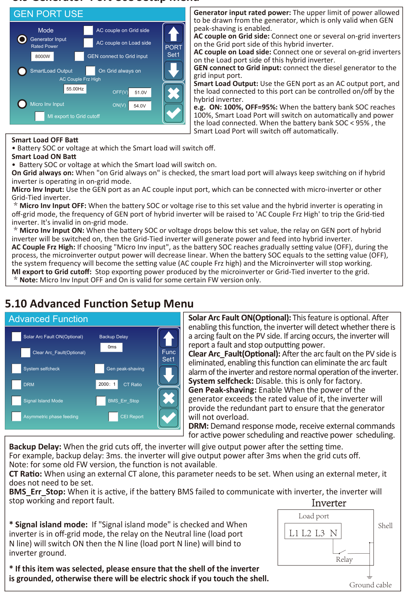

📌 **Popis:** Nahoře obrazovka **GEN PORT USE / PORT Set1** s přepínači režimu **Generator input Rated Power (8000 W)**, **AC couple on Grid side**, **AC couple on Load side**, **GEN connect to Grid input**, **SmartLoad Output** / **On Grid always on** s poli **AC Couple Frz High 55.00 Hz**, **OFF 51.0 V**, **ON 54.0 V**, a **Micro Inv Input** s **MI export to Grid cutoff**. Dole obrazovka **Advanced Function / Func Set1** se zaškrtávacími poli: **Solar Arc Fault ON (Optional)**, **Clear Arc_Fault (Optional)**, **System selfcheck**, **DRM**, **Signal Island Mode**, **Asymmetric phase feeding**, **Backup Delay (0 ms)**, **Gen peak-shaving**, **CT Ratio (20001)**, **BMS_Err_Stop**, **CEI Report**. Vpravo dole malé schéma měniče s relé na nulovém vodiči.

- **Generator input rated power:** The upper limit of power allowed to be drawn from the generator, which is only valid when GEN peak-shaving is enabled.
- **AC couple on Grid side:** Connect one or several on-grid inverters on the Grid port side of this hybrid inverter.
- **AC couple on Load side:** Connect one or several on-grid inverters on the Load port side of this hybrid inverter.
- **GEN connect to Grid input:** connect the diesel generator to the grid input port.
- **Smart Load Output:** Use the GEN port as an AC output port, and the load connected to it can be controlled on/off by the hybrid inverter. *e.g.* ON: 100 %, OFF: 95 % — When the battery bank SOC reaches 100 %, Smart Load Port will switch on automatically and power the load connected. When the battery bank SOC < 95 %, the Smart Load Port will switch off automatically.
- **Smart Load OFF Batt:** Battery SOC or voltage at which the Smart load will switch off.
- **Smart Load ON Batt:** Battery SOC or voltage at which the Smart load will switch on.
- **On Grid always on:** When "on Grid always on" is checked, the smart load port will always keep switching on if hybrid inverter is operating in on-grid mode.
- **Micro Inv Input:** Use the GEN port as an AC couple input port, which can be connected with micro-inverter or other Grid-Tied inverter.
- **Micro Inv Input OFF:** When the battery SOC or voltage rise to this set value and the inverter is operating in off-grid mode, the frequency of GEN port of hybrid inverter will be raised to "AC Couple Frz High" to trip the Grid-tied inverter. It's invalid in on-grid mode.
- **Micro Inv Input ON:** When the battery SOC or voltage drops below this set value, the relay on GEN port of hybrid inverter will be switched on, then the Grid-Tied inverter will generate power and feed into hybrid inverter.
- **AC Couple Frz High:** If choosing "Micro Inv input", as the battery SOC reaches gradually setting value (OFF), during the process, the microinverter output power will decrease linear. When the Battery SOC equals to the setting value (OFF), the system frequency will become the setting value (AC couple Frz high) and the Microinverter will stop working.
- **MI export to Grid cutoff:** Stop exporting power produced by the Microinverter or Grid-Tied inverter to the grid. *Note:* Micro Inv Input OFF and On is valid for some certain FW version only.
- **Solar Arc Fault ON (Optional):** This feature is optional. After enabling this function, the inverter will detect whether there is arcing cloud on the PV side. If arcing occurs, the inverter will report a fault and stop outputting power.
- **Clear Arc_Fault (Optional):** After the arc fault on the PV side is eliminated, enabling this function can eliminate the fault alarm of the inverter and restore normal operation of the inverter.
- **System selfcheck:** Disable. This is only for factory.
- **Gen Peak-shaving:** Enable. When the power of the generator exceeds the rated value of it, the inverter will provide the redundant part to ensure that the generator will not overload.
- **DRM:** Demand response mode, receive external commands for active power scheduling and reactive power scheduling.
- **Backup Delay:** When the grid cuts off, the inverter will give output power after the setting time. For example, backup delay: 3 ms. The inverter will give output power after 3 ms when the grid cuts off. *Note:* for some old FW version, the function is not available.
- **CT Ratio:** When using an external CT alone, this parameter needs to be set. When using an external meter, it does not need to be set.
- **BMS_Err_Stop:** When it is active, if the battery BMS failed to communicate with inverter, the inverter will stop working and report fault.
- **\* Signal island mode:** If "Signal island mode" is checked and When inverter is in off-grid mode, the relay on the Neutral line (load port N line) will switch ON then the N line (load port N line) will bond to inverter ground. **\* If this item was selected, please ensure that the shell of the inverter is grounded, otherwise there will be electric shock if you touch the shell.**
- **Asymmetric phase feeding:** When the loads connected to the Load port have an unbalanced distribution on the three phases and the inverter is working in on-grid mode, enabling this function will ensure an equal power absorption from the three phases of grid.

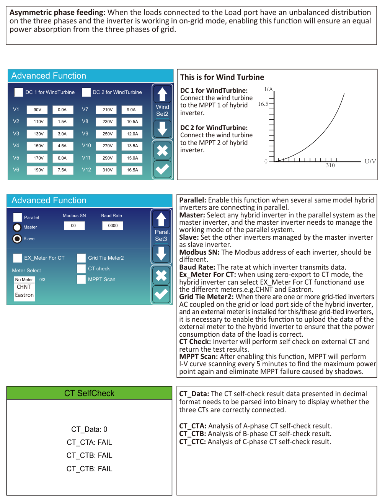

📌 **Popis:** Tři obrazovky. **Advanced Function / Wind Set2** — tabulka dvanácti bodů V1–V12 s dvojicemi napětí a proudu (90 V/0.0 A až 310 V/16.5 A) pro připojení větrné turbíny; vpravo graf výkonové křivky turbíny (exponenciální nárůst). **DC1 for WindTurbine:** Connect the wind turbine to the MPPT 1 of hybrid inverter. **DC2 for WindTurbine:** Connect the wind turbine to the MPPT 2 of hybrid inverter.
>
> **Advanced Function / Paral.Set3** — zaškrtávátko **Parallel**, pole **Modbus SN** (00), **Baud Rate** (0000), přepínač **Master / Slave**, a pole **EX_Meter For CT**, **Grid Tie Meter2**, **Meter Select** (No Meter / CHNT / Eastron), **CT check**, **MPPT Scan**.
>
> **CT SelfCheck** — výsledky autotestu proudových transformátorů: **CT_Data: 0**, **CT_CTA: FAIL**, **CT_CTB: FAIL**, **CT_CTB: FAIL**.

- **Parallel:** Enable this function when several same model hybrid inverters are connecting in parallel.
- **Master:** Select any hybrid inverter in the parallel system as the master inverter, and the master inverter needs to manage the working mode of the parallel system.
- **Slave:** Set the other inverters managed by the master inverter as slave inverter.
- **Modbus SN:** The Modbus address of each inverter, should be different.
- **Baud Rate:** The rate at which inverter transmits data.
- **EX_Meter For CT:** when using zero-export to CT mode, the hybrid inverter can select EX_Meter For CT function and use the different meters, e.g. CHNT and Eastron.
- **Grid Tie Meter2:** When there are one or more grid-tied inverters AC coupled on the grid or load port side of the hybrid inverter, and an external meter is installed for this/these grid-tied inverters, it is necessary to enable this function to upload the data of the external meter to the hybrid inverter to ensure that the power consumption data of the load is correct.
- **CT Check:** Inverter will perform self check on external CT and return the test results.
- **MPPT Scan:** After enabling this function, MPPT will perform I-V curve scanning every 5 minutes to find the maximum power point again and eliminate MPPT failure caused by shadows.
- **CT_Data:** The CT self-check result data presented in decimal format needs to be parsed into binary to display whether the three CTs are correctly connected. **CT_CTA:** Analysis of A-phase CT self-check result. **CT_CTB:** Analysis of B-phase CT self-check result. **CT_CTC:** Analysis of C-phase CT self-check result.

### 5.11 Device Info Setup Menu

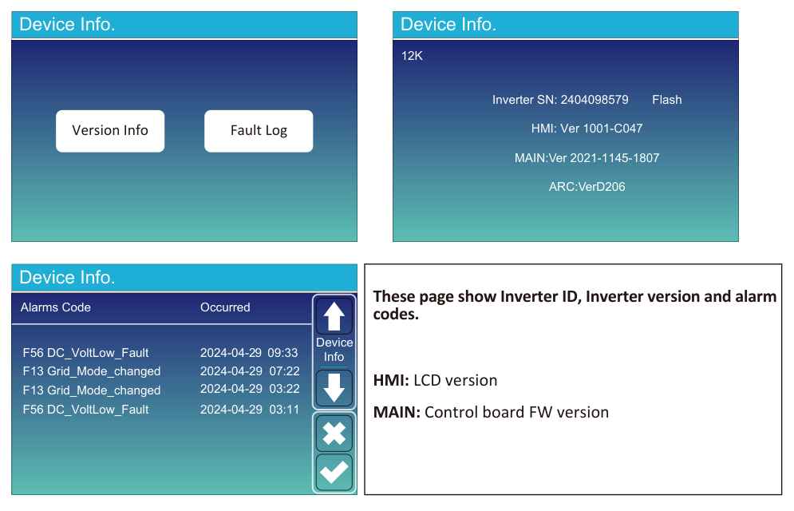

📌 **Popis:** Tři obrazovky **Device Info.** — první se dvěma dlaždicemi **Version Info** a **Fault Log**; druhá s údaji **12K**, **Inverter SN: 2404098579 Flash**, **HMI: Ver 1001-C047**, **MAIN: Ver 2021-1145-1807**, **ARC: VerD206**; třetí s tabulkou **Alarms Code / Occurred**: F56 DC_VoltLow_Fault (2024-04-29 09:33), F13 Grid_Mode_changed (07:22), F13 Grid_Mode_changed (03:22), F56 DC_VoltLow_Fault (03:11).

These page show Inverter ID, Inverter version and alarm codes. **HMI:** LCD version. **MAIN:** Control board FW version.

---

## 6. Mode

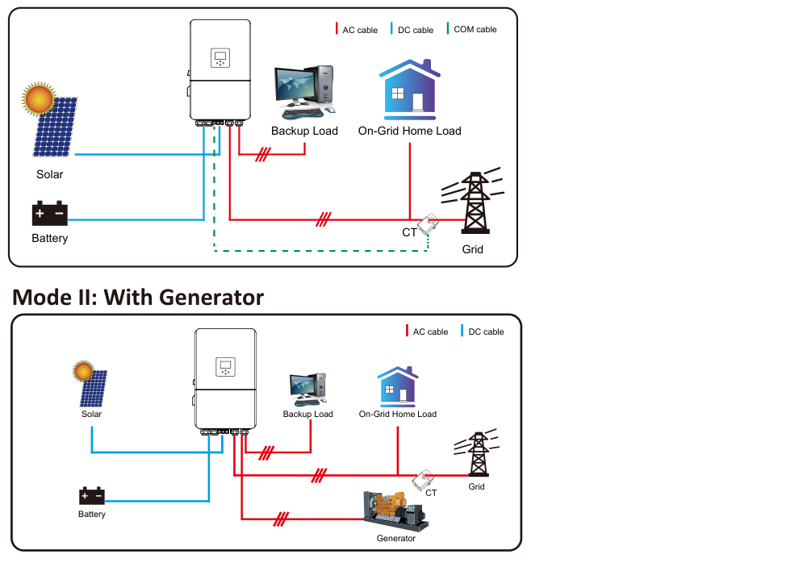

📌 **Popis:** Dvě blokové schémata.
>
> - **Mode I: Basic** — **Solar** a **Battery** do měniče (modré DC vodiče), z měniče červené AC vodiče na **Backup Load** a **On-Grid Home Load**, dále přes **CT** ke **Grid**. Šrafované značky „//" označují místa, kde tok energie může být přerušen.
> - **Mode II: With Generator** — totéž plus **Generator** připojený na společnou AC sběrnici mezi zátěží a sítí.

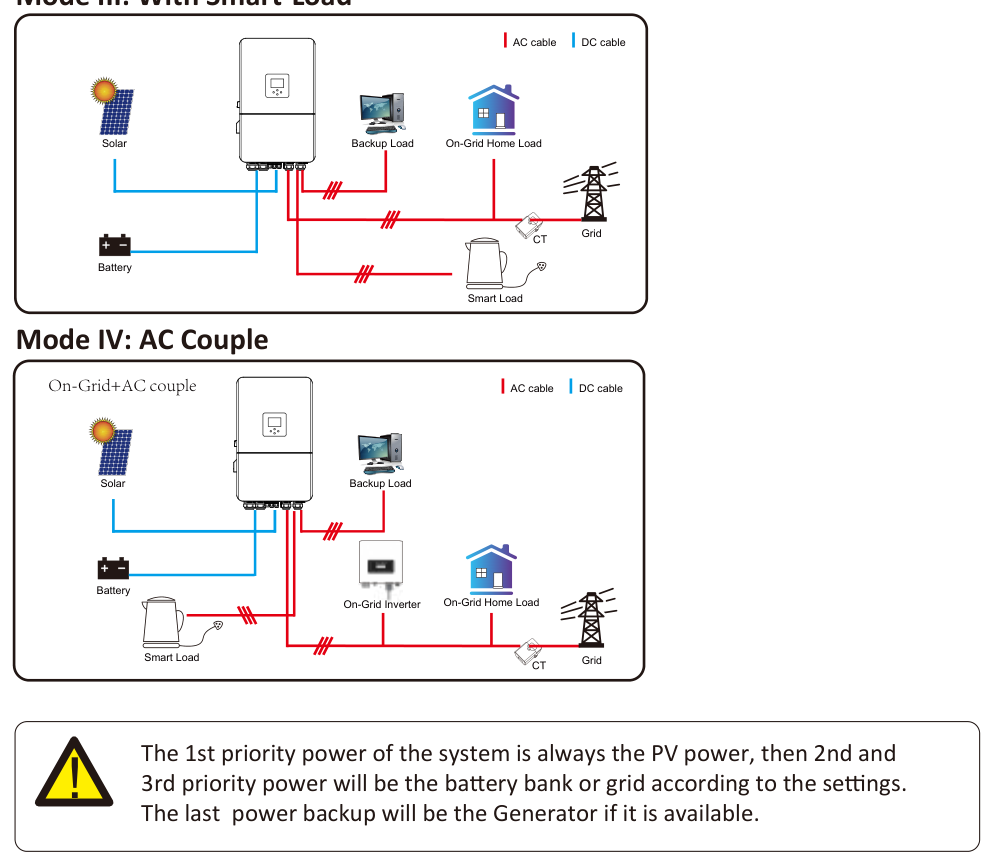

📌 **Popis:** Dvě blokové schémata.
>
> - **Mode III: With Smart-Load** — jako Mode I, navíc **Smart Load** (ikona varné konvice) připojený na samostatný výstup — spotřebič, který měnič sám spíná podle SOC baterie. **Toto je režim použitelný pro ohřev TUV z přebytků.**
> - **Mode IV: AC Couple** — vedle **Backup Load** je na AC stranu připojen **On-Grid Inverter** (další, síťový měnič) a **Smart Load**, vše se sbíhá k **On-Grid Home Load** a přes **CT** ke **Grid**. Umožňuje připojit existující síťovou FVE k hybridnímu měniči.

> ⚠️ The 1st priority power of the system is always the PV power, then 2nd and 3rd priority power will be the battery bank or grid according to the settings. The last power backup will be the Generator if it is available.

---

## 7. Limitation of Liability

In addition to the product warranty described alone, the state and local laws and regulations provide financial compensation for the product's power connection (including violation of implied terms and warranties). The company hereby declares that the terms and conditions of the product and the policy can and can only legally exclude all liability within a limited scope.

**Chart 7-1 Fault information**

| Error code | Description | Solutions |
|---|---|---|
| **F01** | DC input polarity reverse fault | 1. Check the PV input polarity. 2. Seek help from us, if can not go back to normal state. |
| **F07** | DC_START_Failure | 1. The BUS voltage can't be built from PV or battery. 2. Restart the inverter. If the fault still exists, please contact us for help. |
| **F13** | working mode change | 1. When the grid type and frequency changed it will report F13; 2. When the battery mode was changed to "No battery" mode, it will report F13; 3. For some old FW version, it will report F13 when the system work mode changed; 4. Generally, it will disappear automatically when shows F13; 5. If still same, turn off the DC switch and AC switch and wait for one minute and then turn on the DC/AC switch; 6. Seek help from us, if can not go back to normal state. |
| **F15** | AC over current fault of software | AC side over current fault. 1. Please check whether the backup load power and common load power are within the range; 2. Restart and check whether it is in normal; 3. Seek help from us, if can not go back to normal state. |
| **F16** | AC leakage current fault | Leakage current fault. 1. Check the PV side cable ground connection. 2. Restart the system 2–3 times. 3. If the fault still existing, please contact us for help. |
| **F18** | AC over current fault of hardware | AC side over current fault. 1. Please check whether the backup load power and common load power are within the range; 2. Restart and check whether it is in normal; 3. Seek help from us, if cannot go back to normal state. |
| **F20** | DC over current fault of the hardware | DC side over current fault. 1. Check PV module connect and battery connect; 2. When in the off-grid mode, the inverter startup with big power load, it may report F20. Please reduce the load power connected; 3. Turn off the DC switch and AC switch and then wait one minute, then turn on the DC/AC switch again; 4. Seek help from us, if can not go back to normal state. |
| **F21** | Tz_HV_Overcurr_fault | BUS over current. 1. Check the PV input current and battery current setting. 2. Restart the system 2~3 times. 3. If the fault still exists, please contact us for help. |
| **F22** | Tz_EmergStop_Fault | Remotely shutdown. 1. It tells the inverter is remotely controlled. |
| **F23** | Tz_GFCI_OC_ current is transient over current | Leakage current fault. 1. Check PV side cable ground connection. 2. Restart the system 2~3 times. 3. If the fault still exists, please contact us for help. |
| **F24** | DC insulation failure | PV isolation resistance is too low. 1. Check the connection of PV panels and inverter is firmly and correctly; 2. Check whether the PE cable of inverter is connected to ground; 3. Seek help from us, if can not go back to normal state. |
| **F26** | The DC busbar is unbalanced | 1. Please wait for a while and check whether it is normal; 2. When the load power of 3 phases is big different, it will report the F26. 3. When there's DC leakage current, it will report F26. 4. Restart the system 2~3 times. 5. Seek help from us, if can not go back to normal state. |
| **F29** | Parallel CAN Bus fault | 1. When in parallel mode, check the parallel communication cable connection and hybrid inverter communication address setting; 2. During the parallel system startup period, inverters will report F29. But when all inverters are in ON status, it will disappear automatically; 3. If the fault still exists, please contact us for help. |
| **F34** | AC Overcurrent fault | 1. Check the backup load connected, make sure it is in allowed power range. 2. If the fault still exists, please contact us for help. |
| **F41** | Parallel system stop | 1. Check the hybrid inverter work status. If there's 1 pcs hybrid inverter shutdown, all hybrid inverters will report F41 fault. 2. If the fault still exists, please contact us for help. |
| **F42** | AC line low voltage | Grid voltage fault. 1. Check the AC voltage is in the range of standard voltage in specification; 2. Check whether grid AC cables are firmly and correctly connected; 3. Seek help from us, if can not go back to normal state. |
| **F46** | backup battery fault | 1. Please check each battery status, such as voltage/SOC and parameters etc., and make sure all the parameters are same. 2. If the fault still exists, please contact us for help. |
| **F47** | AC over frequency | Grid frequency out of range. 1. Check the frequency is in the range of specification or not; 2. Check whether AC cables are firmly and correctly connected; 3. Seek help from us, if can not go back to normal state. |
| **F48** | AC lower frequency | Grid frequency out of range. 1. Check the frequency is in the range of specification or not; 2. Check whether AC cables are firmly and correctly connected; 3. Seek help from us, if can not go back to normal state. |
| **F55** | DC busbar voltage is too high | BUS voltage is too high. 1. Check whether battery voltage is too high; 2. Check the PV input voltage, make sure it is within the allowed range; 3. Seek help from us, if can not go back to normal state. |
| **F56** | DC busbar voltage is too low | Battery voltage low. 1. Check whether battery voltage is too low; 2. If the battery voltage is too low, using PV or grid to charge the battery; 3. Seek help from us, if can not go back to normal state. |
| **F58** | BMS communication fault | 1. It tells the communication between hybrid inverter and battery BMS disconnected when "BMS_Err_Stop" is active. 2. If don't want to see this happen, you can disable "BMS_Err_Stop" item on the LCD; 3. If the fault still exists, please contact us for help. |
| **F62** | DRMs0_stop | 1. Check the DRM function is active or not; 2. Seek help from us, if can not go back to normal state after restart the system. |
| **F63** | ARC fault | 1. Check PV module cable connection and clear the fault; 2. Seek help from us, if can not go back to normal state. |
| **F64** | Heat sink high temperature failure | Heat sink temperature is too high. 1. Check whether the work environment temperature is too high; 2. Turn off the inverter for 10 mins and restart; 3. Seek help from us, if can not go back to normal state. |

Under the guidance of our company, customers return our products so that our company can provide service of maintenance or replacement of products of the same value. Customers need to pay the necessary freight and other related costs. Any replacement or repair of the product will cover the remaining warranty period of the product. If any part of the product or product is replaced by the company itself during the warranty period, all rights and interests of the replacement product or component belong to the company.

**Factory warranty does not include damage due to the following reasons:**

- Damage during transportation of equipment
- Damage caused by incorrect installation or commissioning
- Damage caused by failure to comply with operation instructions, installation instructions or maintenance instructions
- Damage caused by attempts to modify, alter or repair products
- Damage caused by incorrect use or operation
- Damage caused by insufficient ventilation of equipment
- Damage caused by failure to comply with applicable safety standards or regulations
- Damage caused by natural disasters or force majeure (e.g. floods, lightning, overvoltage, storms, fires, etc.)

In addition, normal wear or any other failure will not affect the basic operation of the product. Any external scratches, stains or natural mechanical wear does not represent a defect in the product.

---

## 8. Datasheet

| Model | SUN-14K-SG05LP3-EU-SM2 | SUN-15K-SG05LP3-EU-SM2 | SUN-16K-SG05LP3-EU-SM2 | SUN-18K-SG05LP3-EU-SM2 | SUN-20K-SG05LP3-EU-SM2 |
|---|---|---|---|---|---|
| **Battery Input Data** | | | | | |
| Battery Type | Lead-acid or Lithium-ion | ← | ← | ← | ← |
| Battery Voltage Range (V) | 40–60 | ← | ← | ← | ← |
| Max. Charging Current (A) | 260 | 280 | 300 | 330 | 350 |
| Max. Discharging Current (A) | 260 | 280 | 300 | 330 | 350 |
| Charging Strategy for Li-ion Battery | Self-adaption to BMS | ← | ← | ← | ← |
| Number of Battery Input | 2 | ← | ← | ← | ← |
| **PV String Input Data** | | | | | |
| Max. PV access power (W) | 28000 | 30000 | 32000 | 36000 | 40000 |
| Max. PV Input Power (W) | 22400 | 24000 | 25600 | 28800 | 32000 |
| Max. PV Input Voltage (V) | 800 | ← | ← | ← | ← |
| Start-up Voltage (V) | 160 | ← | ← | ← | ← |
| PV Input Voltage Range (V) | 160–800 | ← | ← | ← | ← |
| MPPT Voltage Range (V) | 160–650 | ← | ← | ← | ← |
| Full Load MPPT Voltage Range (V) | 310–650 | 330–650 | 350–650 | 400–650 | 440–650 |
| Rated PV Input Voltage (V) | 550 | ← | ← | ← | ← |
| Max. Operating PV Input Current (A) | 36+36 | ← | ← | ← | ← |
| Max. Input Short-Circuit Current (A) | 54+54 | ← | ← | ← | ← |
| No. of MPP Trackers / No. of Strings per MPP Tracker | 2 / 2+2 | ← | ← | ← | ← |
| Max. Inverter Backfeed Current to The Array | 0 | ← | ← | ← | ← |
| **AC Input/Output Data** | | | | | |
| Rated AC Input/Output Active Power (W) | 14000 | 15000 | 16000 | 18000 | 20000 |
| Max. AC Input/Output Apparent Power (VA) | 15400 | 16500 | 17600 | 19800 | 22000 |
| Peak Power (off-grid) (W) | 2 times of rated power, 10 s | ← | ← | ← | ← |
| Rated AC Input/Output Current (A) | 21.3/20.3 | 22.8/21.8 | 24.3/23.2 | 27.3/26.1 | 30.4/29 |
| Max. AC Input/Output Current (A) | 23.4/22.4 | 25/24 | 26.7/25.6 | 30/28.7 | 33.4/31.9 |
| **Max. Continuous AC Passthrough (grid to load) (A)** | **70** | ← | ← | ← | ← |
| Max. Output Fault Current (A) | 46.8 | 50 | 53.4 | 60 | 66.8 |
| Max. Output Overcurrent Protection (A) | 100 | ← | ← | ← | ← |
| Rated Input/Output Voltage/Range (V) | 220/380V, 230/400V · 0.85Un–1.1Un | ← | ← | ← | ← |
| Grid Connection Form | 3L+N+PE | ← | ← | ← | ← |
| Rated Input/Output Grid Frequency/Range | 50Hz / 45Hz–55Hz · 60Hz / 55Hz–65Hz | ← | ← | ← | ← |
| Power Factor Adjustment Range | 0.8 leading – 0.8 lagging | ← | ← | ← | ← |
| Total Current Harmonic Distortion THDi | <3 % (of nominal power) | ← | ← | ← | ← |
| DC Injection Current | <0.5%In | ← | ← | ← | ← |
| **Efficiency** | | | | | |
| Max. Efficiency | 97.60 % | ← | ← | ← | ← |
| Euro Efficiency | 97.00 % | ← | ← | ← | ← |
| MPPT Efficiency | >99 % | ← | ← | ← | ← |
| **Equipment Protection** | | | | | |
| DC reverse polarity protection | Yes | ← | ← | ← | ← |
| AC Output Overcurrent Protection | Yes | ← | ← | ← | ← |
| AC Output Overvoltage Protection | Yes | ← | ← | ← | ← |
| AC Output Short Circuit Protection | Yes | ← | ← | ← | ← |
| Thermal Protection | Yes | ← | ← | ← | ← |
| Insulation Impedance detection | Yes | ← | ← | ← | ← |
| DC Component Monitoring | Yes | ← | ← | ← | ← |
| Arc fault circuit interrupter (AFCI) | Optional | ← | ← | ← | ← |
| Anti-islanding protection | Yes | ← | ← | ← | ← |
| DC Switch | Yes | ← | ← | ← | ← |
| Residual Current Detection | Yes | ← | ← | ← | ← |
| Surge Protection Level | TYPE II(DC), TYPE II(AC) | ← | ← | ← | ← |
| **Interface** | | | | | |
| Display | LCD+LED | ← | ← | ← | ← |
| Communication Interface | **RS232, RS485, CAN** | ← | ← | ← | ← |
| Monitor Mode | GPRS/WIFI/Bluetooth/4G/**LAN** (optional) | ← | ← | ← | ← |
| **General Data** | | | | | |
| Operating Temperature Range | −40 to +60 °C, >45 °C Derating | ← | ← | ← | ← |
| Permissible Ambient Humidity | 0–100 % | ← | ← | ← | ← |
| Permissible Altitude | 3000 m | ← | ← | ← | ← |
| Noise | 60 dB | ← | ← | ← | ← |
| Ingress Protection (IP) Rating | IP65 | ← | ← | ← | ← |
| Inverter Topology | Non-Isolated | ← | ← | ← | ← |
| Over Voltage Category | OVC II(DC), OVC III(AC) | ← | ← | ← | ← |
| Cabinet size (W×H×D) [mm] | 456 × 750 × 268.5 (excluding connectors and brackets) | ← | ← | ← | ← |
| Weight (kg) | 51.9 | ← | ← | ← | ← |
| Warranty | 5 Years / 10 Years — the Warranty Period Depends the Final Installation Site of Inverter. More Info Please Refer to Warranty Policy | ← | ← | ← | ← |
| Type of Cooling | Intelligent Air Cooling | ← | ← | ← | ← |
| Grid Regulation | IEC 61727, IEC 62116, CEI 0-21, EN 50549, NRS 097, RD 140, UNE 217002, OVE-Richtlinie R25, G99, VDE-AR-N 4105 | ← | ← | ← | ← |
| Safety EMC/Standard | IEC/EN 61000-6-1/2/3/4, IEC/EN 62109-1, IEC/EN 62109-2 | ← | ← | ← | ← |

---

## 9. Appendix I

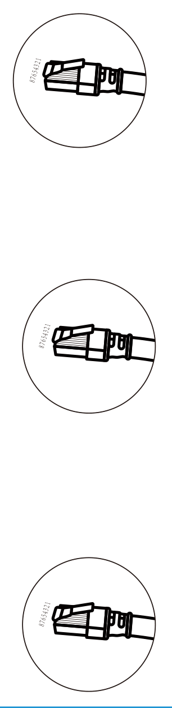

📌 **Popis:** Tři perokresby čelního pohledu na zdířku RJ45 s očíslovanými piny 1–8 zleva doprava, pod každou kruhový detail zasunutého konektoru s kabelem. Odshora: **BMS 485/CAN Port**, **Meter-485 Port**, **Modbus port**.

**Definition of RJ45 Port Pin for BMS**

| No. | RS485 Pin |
|---|---|
| 1 | 485_B |
| 2 | 485_A |
| 3 | — |
| 4 | CAN-H |
| 5 | CAN-L |
| 6 | GND_485 |
| 7 | 485_A |
| 8 | 485_B |

**Definition of RJ45 Port Pin for Meter-485**

| No. | Meter-485 Pin |
|---|---|
| 1 | METER-485-B |
| 2 | METER-485-A |
| 3 | COM-5V |
| 4 | METER-485-B |
| 5 | METER-485-A |
| 6 | COM-GND |
| 7 | METER-485-A |
| 8 | METER-485-B |

**Definition of RJ45 Port Pin of "Modbus port" for remotely monitoring**

| No. | Modbus port |
|---|---|
| 1 | 485_B |
| 2 | 485_A |
| 3 | GND_485 |
| 4 | — |
| 5 | — |
| 6 | GND_485 |
| 7 | 485_A |
| 8 | 485_B |

**DRM:** It is used to accept the external control command.

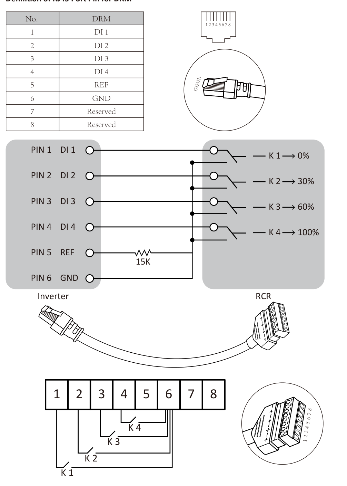

📌 **Popis:** Nahoře perokresba zdířky RJ45 a kruhový detail zasunutého konektoru. Uprostřed schéma propojení **Inverter ↔ RCR** (přijímač HDO / signálu distributora): šedý blok vlevo s piny **PIN1 DI1, PIN2 DI2, PIN3 DI3, PIN4 DI4, PIN5 REF, PIN6 GND**, šedý blok vpravo se čtyřmi spínacími kontakty **K1 → 0 %**, **K2 → 30 %**, **K3 → 60 %**, **K4 → 100 %**. Mezi PIN5 (REF) a společným uzlem je rezistor **15K**. Dole nákres propojovacího kabelu RJ45 → svorkovnice a schéma osazení svorek 1–8 s přiřazením K1–K4.

**Definition of RJ45 Port Pin for DRM**

| No. | DRM |
|---|---|
| 1 | DI 1 |
| 2 | DI 2 |
| 3 | DI 3 |
| 4 | DI 4 |
| 5 | REF |
| 6 | GND |
| 7 | Reserved |
| 8 | Reserved |

This model of inverter has two types of logger interfaces, **DB9** and **USB**. Please refer to the actual inverter received for the actual interface type.

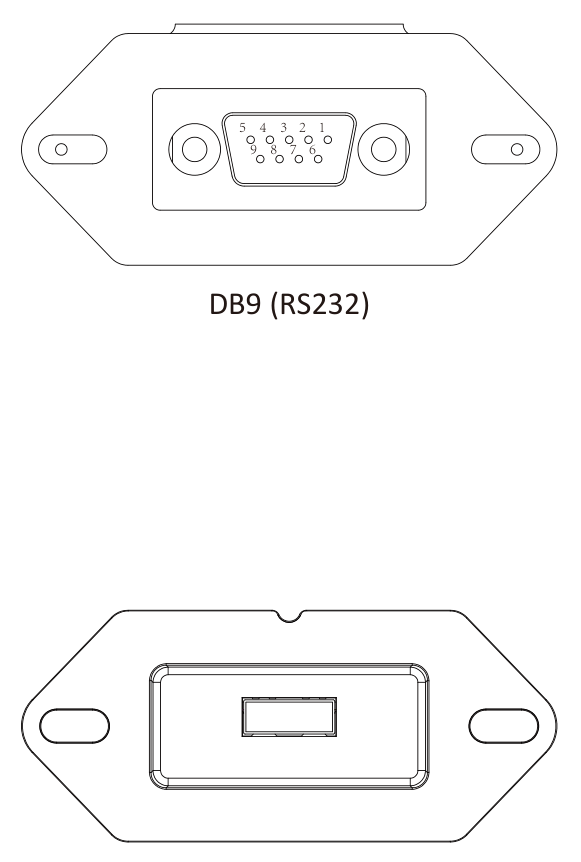

📌 **Popis:** Dvě perokresby montážních panelů s konektory. Nahoře **DB9 (RS232)** — devítipinový konektor s očíslovanými piny 5-4-3-2-1 v horní řadě a 9-8-7-6 ve spodní. Dole **USB** — obdélníkový USB konektor typu A. Toto je fyzické rozhraní pro datalogger / WiFi klíčenku.

**RS232**

| No. | RS232 |
|---|---|
| 1 | — |
| 2 | TX |
| 3 | RX |
| 4 | — |
| 5 | D-GND |
| 6 | — |
| 7 | — |
| 8 | — |
| 9 | 12 Vdc |

---

## 10. Appendix II

1. Split Core Current Transformer (CT) dimension: (mm)
2. Secondary output cable length is **4 m**.

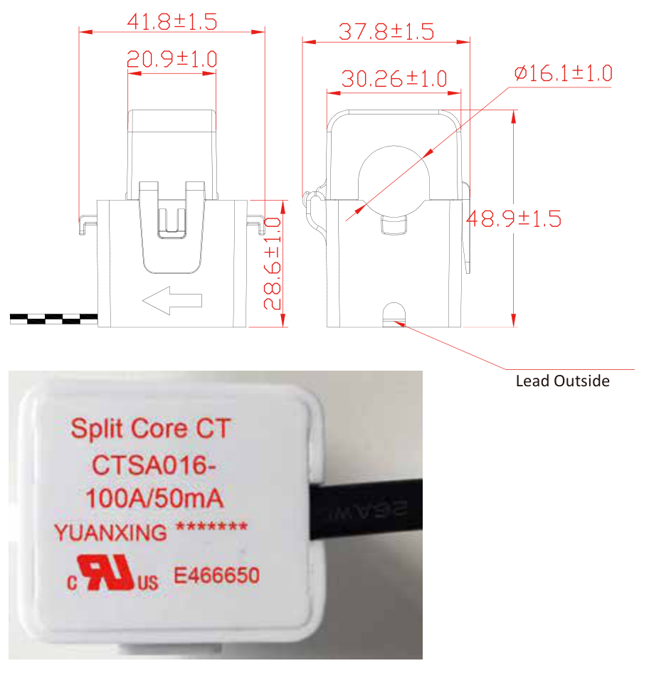

📌 **Popis:** Nahoře kótovaný nákres rozevíracích proudových kleští ve dvou pohledech: čelní šířka **41,8 ±1,5 mm**, vnitřní **20,9 ±1,0 mm**, výška **28,6 ±1,0 mm**; boční pohled **37,8 ±1,5 mm** a **30,26 ±1,0 mm** šířka, **48,9 ±1,5 mm** výška, průměr otvoru pro vodič **⌀16,1 ±1,0 mm**. Popisek **Lead Outside** označuje stranu vývodu kabelu; šipka na těle udává směr toku proudu. Dole fotografie skutečného CT — bílé plastové pouzdro s červeným potiskem **„Split Core CT · CTSA016-100A/50mA · YUANXING"** a certifikační značkou **UL E466650**. Průměr otvoru 16 mm omezuje maximální průřez vodiče, na který kleště nasadíte.

---

## 11. EU Declaration of Conformity

Within the scope of the EU directives:

- Electromagnetic compatibility **2014/30/EU (EMC)**
- Low Voltage Directive **2014/35/EU (LVD)**
- Restriction of the use of certain hazardous substances **2011/65/EU (RoHS)**

NINGBO DEYE INVERTER TECHNOLOGY CO., LTD. confirms herewith that the products described in this document are in compliance with the fundamental requirements and other relevant provisions of the above mentioned directives. The entire EU Declaration of Conformity and certificate can be found at https://www.deyeinverter.com/download/#hybrid-inverter-5.

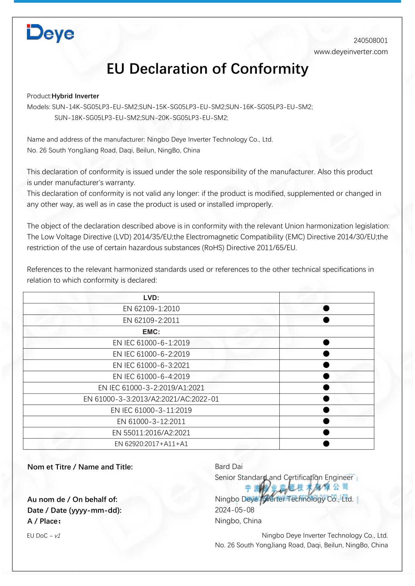

📌 **Popis:** Naskenované **EU Declaration of Conformity**, dokument č. 240508001. Uvádí produkt **Hybrid Inverter**, modely SUN-14K až SUN-20K-SG05LP3-EU-SM2, výrobce Ningbo Deye Inverter Technology Co., Ltd., No. 26 South YongJiang Road, Daqi, Beilun, NingBo, China. Tabulka harmonizovaných norem s tečkami v pravém sloupci:
>
> - **LVD:** EN 62109-1:2010, EN 62109-2:2011
> - **EMC:** EN IEC 61000-6-1:2019, EN IEC 61000-6-2:2019, EN IEC 61000-6-3:2021, EN IEC 61000-6-4:2019, EN IEC 61000-3-2:2019/A1:2021, EN 61000-3-3:2013/A2:2021/AC:2022-01, EN IEC 61000-3-11:2019, EN 61000-3-12:2011, EN 55011:2016/A2:2021, EN 62920:2017+A11+A1
>
> Podepsáno **Bard Dai**, Senior Standard and Certification Engineer, datum **2024-05-08**, Ningbo, China, s otiskem firemního razítka. V pravém horním rohu značka **CE**. Dole datum revize dokumentu 2025-12-30.

---

*Převedeno z originálního PDF `manual_sun-14-20k-sg05lp3-eu-sm2_20260319_en.pdf` (58 stran). Obrázky vyextrahovány z vektorové grafiky ve 200 DPI. Popisy obrázků označené `📌 Popis:` jsou doplněné, v originále nejsou.*
